# The Enterprise Brain reference architecture

An **enterprise brain** gives people and software governed access to an organisation's knowledge. It captures knowledge, finds evidence, supports reasoning, and controls the work that follows.

This repository defines the capabilities and contracts for that system. The design is independent of products and vendors. An organisation can map the capabilities to its own technology.

The [Lexikon](https://antikas.io/writing/lexikon/) gives stable definitions for the enterprise brain, the deterministic spine, and related terms. [A Reference Architecture for the Enterprise Brain](https://antikas.io/writing/the-enterprise-brain/) gives a shorter introduction to the design.

## The rule for truth

The architecture uses a **deterministic spine**. Rules over recorded evidence decide what the system may store or present as true.

The model can read, draft, summarise, explain, and propose. A person approves new knowledge claims. Operational systems remain responsible for the current facts they own.

The design keeps five kinds of information separate:

- **Approved knowledge** contains the claims that the organisation has accepted.
- **Operational facts** remain in the systems that own them.
- **Knowledge-derived views** include indexes, clusters, summaries, and observations built from approved knowledge.
- **Operational-derived views** include mastered records and analytical projections built from operational sources.
- **Control state** records workflow events, approvals, lineage, access decisions, release decisions, and serving status.

Every derived view records its sources. The system can build the view again from those sources. A materialised operational view also carries its build time, freshness limit, and reconciliation result.

## What the system does

The enterprise brain covers the full path from source to action.

It maps the systems, stores, and people that hold useful material. Each source stream receives a declared route into the architecture. Organisational knowledge enters through capture and approval. Current operational facts are read through governed federation or a declared projection.

Retrieval finds evidence from approved knowledge. Observations describe patterns found across that evidence. Intent routing selects the evidence source for a request. Reasoning routing selects a general model or a specialist after the evidence has been assembled.

Long-running work uses a durable journal. The journal records intent before an external effect and records the result before any answer or acknowledgement leaves the process. Approval waits and uncertain effects survive a restart.

Every external answer passes through one release service. The service checks the recipient, access grant, protection class, lawful basis, query policy, minimisation rules, and any required human verdict. It records the release or refusal before sending the answer.

The system learns from use through governed capture and evaluation. A candidate lesson carries its source and evidence. Promotion into approved knowledge uses the same claim gate as any other knowledge claim.

Trust boundaries define storage. Business units inside one enterprise can share an entity master while retaining their own policy scope. A sensitive domain can use its own store and index. Separate enterprises use separate storage and exchange only governed projections.

## What is in this repository

The [index](INDEX.md) gives a reading order for the full architecture.

### Documents

| Document | What it contains |
|---|---|
| [Logical reference architecture](logical-reference-architecture.md) | The capabilities, contracts, information classes, trust boundaries, and links to the evaluation requirements. |
| [Illustrative solution architecture](illustrative-solution-architecture.md) | One component design that applies the logical contracts. |
| [Alternative solution patterns](alternative-solution-patterns.md) | Other ways to place the same contracts across an estate. |
| [Evaluation framework](eval/evaluation-framework.md) | The requirements, evidence, and failure conditions used to assess a working system. |

### Diagrams

Each SVG image comes from a D2 text file. The trust boundary diagram also has Mermaid source.

| Diagram | What it shows | Source |
|---|---|---|
| [Summary](diagrams/summary-at-a-glance.svg) | The full design and the controls in the deterministic spine. | [D2](diagrams/summary-at-a-glance.d2) |
| [Capability map](diagrams/view1-capability-map.svg) | The capabilities grouped by the outcome they own. | [D2](diagrams/view1-capability-map.d2) |
| [Components and flows](diagrams/view2-component-flow.svg) | Information stores, derived views, routing, durable work, and release. | [D2](diagrams/view2-component-flow.d2) |
| [Reasoning tiers](diagrams/view3-two-tier-expression.svg) | Intent routing, reasoning routing, the general model, and the specialist inventory. | [D2](diagrams/view3-two-tier-expression.d2) |
| [Trust boundaries](diagrams/view4-mesh-topology.svg) | Business unit scopes, a sensitive domain, separate enterprises, and governed projections. | [D2](diagrams/view4-mesh-topology.d2), [Mermaid](diagrams/view4-mesh-topology.mmd) |
| [Learning and operation](diagrams/view5-learn-and-run.svg) | Governed learning and the recovery of durable work after failure. | [D2](diagrams/view5-learn-and-run.d2) |
| [Illustrative solution](diagrams/illustrative-solution-architecture.svg) | The logical contracts placed on one component design. | [D2](diagrams/illustrative-solution-architecture.d2) |
| [Alternative patterns](diagrams/alternative-solution-patterns.svg) | Several ways to place the logical contracts in an estate. | [D2](diagrams/alternative-solution-patterns.d2) |

## Licence

The public release uses the Creative Commons Attribution 4.0 International licence. The licence covers the published material only. See [`LICENSE`](LICENSE) and the [CC BY 4.0 licence](https://creativecommons.org/licenses/by/4.0/).
