# Enterprise Brain: alternative solution patterns

## Purpose

The logical architecture defines outcomes and contracts. A solution pattern places those contracts on a set of component types, services, and stores.

The patterns below show common estate shapes. They describe design choices. Product choice and implementation status sit outside their scope.

Each pattern changes the placement and operation of components. The logical contracts remain fixed.

## The patterns

Each pattern shows where the capabilities can sit in a given estate shape.

### Pattern A: self-hosted and file-first

The knowledge source of truth uses an open document format under version control. Local libraries provide the indexes and embeddings. A hosted general model provides reasoning through a replaceable interface. A local journal records durable work.

*Where it fits.* Small deployments, strict data residency, and teams that need a human-readable record of approved knowledge.

*Strengths.* Direct provenance, simple human approval, low-cost view rebuilds, and clear change history.

*Costs.* Large-scale concurrency, tenant isolation, federation across large systems, and enterprise operations need added services.

### Pattern B: managed search and analytical warehouse

Managed services provide search, workflows, model serving, lineage, and policy. A columnar warehouse supports operational queries and projections.

*Where it fits.* Organisations with a main cloud data platform and an established operational warehouse.

*Strengths.* Scale, broad federation, catalogue-based lineage, and established operating controls.

*Costs.* The design must separate knowledge from operational data inside the platform. It must also add human claim approval and tested provider interfaces.

### Pattern C: platform-native data cloud

One data platform provides retrieval, reasoning, durable execution, governance, lineage, and access control. Governed shares connect data across domains.

*Where it fits.* Organisations whose data and governance already use one platform.

*Strengths.* One access model, one lineage service, and little data movement.

*Costs.* The organisation depends heavily on one provider. Replaceable interfaces and tested exports carry more weight in this pattern.

### Pattern D: federated hybrid

The organisation controls the knowledge plane. Governed federation reads operational facts from their owning systems. More than one model provider can sit behind the reasoning interface.

*Where it fits.* Regulated organisations with distributed operational data and a central knowledge corpus.

*Strengths.* Clear information planes, local residency, and provider substitution.

*Costs.* Live federation adds latency, variable cost, and more work at query time.

### Any other shape

Other estate shapes can apply the same contracts. The mapping below shows the fixed rules for each capability.

## Fixed design rules

**Truth.** Rules over recorded evidence decide what the system may store or present as true. The model works within those rules.

**Source routing.** Each source stream declares one route: knowledge ingestion, operational federation, or human capture. Missing routes fail configuration.

**Claim approval.** A person approves each semantic claim before it enters approved knowledge. Contradictions enter a review queue with both claims intact.

**Control state.** Policies, registries, workflow events, verdicts, lineage stamps, release records, and serving status use governed control state. Approved knowledge uses its own store and admission path.

**Provenance and lineage.** Provenance travels with each record. Materialised figures carry lineage captured during the build. Federated figures record their query path before release.

**Operational authority.** Operational systems own their current facts. Materialised projections carry a build stamp, reconciliation result, source path, and freshness limit.

**Entity mastering.** One enterprise entity master resolves shared entities across business unit scopes. Clear matches follow rules. Uncertain matches wait for a recorded human decision.

**Derived views.** Indexes, clusters, observations, summaries, masters, and data products can be generated again from recorded sources.

**Observations.** Algorithms find the structure in an observation. The prose cites and stays within its evidence. Serving status controls whether an observation can be retrieved.

**Organisational contracts.** Draft contracts become active after evidence checks, confirmation by the people who run the operation, and maker-checker approval.

**Release.** One release service handles external answers. It checks the required verdicts and records the release or refusal before sending data.

**Durable work.** The journal records intent before an effect and the result before any output. Approval waits and effect settlement survive process loss. Recovery uses the effect's idempotency class.

**Repair.** Repair follows a declared order. Exhausted recovery records a clear failed state. A person approves irreversible recovery.

**Provider interfaces.** External providers sit behind replaceable interfaces. Substitution tests provide evidence that the interface works.

## Contract mapping

Each row separates solution choices from the fixed logical contract.

### G1: source reach, knowledge ingress and lifecycle

| Contract | Solution choices | Fixed contract |
|---|---|---|
| `C-G1.1` Capture proprietary knowledge | Connector types, formats, and push or pull capture. | Capture emits a staged candidate with its origin. Claim admission belongs to `C-G3.2`. |
| `C-G1.2` Maintain corpus freshness | Sweeps, change feeds, or platform metadata. | Freshness covers the whole corpus and uses recorded verification dates. |
| `C-G1.3` Sweep contradiction stock | Sweep engine, cadence, and blocking strategy. | The system measures latent contradictions across the corpus and sends conflicts for review. |
| `C-G1.4` Conform to ontology under evolution | Where the ontology descriptor lives and how conformance is computed. | A schema change is measured for conformance and affected scope before it lands. |
| `C-G1.5` Govern knowledge lifecycle | Job, workflow, or platform policy. | The system runs the lifecycle loop and acts on obsolete or non-conforming knowledge. |
| `C-G1.6` Govern source reach across planes | How the estate register is held and how reach is prioritised. | Every stream carries exactly one declared plane, a scope label, a conformance contract and an explicit materialisation dial. |

### G2: retrieval, understanding and answer composition

| Contract | Solution choices | Fixed contract |
|---|---|---|
| `C-G2.1` Retrieve relevant context | Index technology, blend weights, and library or service placement. | Retrieval blends complementary signals and records enough detail to explain a result. |
| `C-G2.2` Compose context for reasoning | Slot design, budget size, template mechanics. | Composition is deterministic and budgeted before any model call. |
| `C-G2.3` Surface evidence-backed observations | Where observations are stored, how clustering is computed, which model narrates. | The structure is algorithm-owned, the prose is bounded to cited evidence, serving status survives regeneration, and held or retired material is neither served nor embedded. |
| `C-G2.4` Route intent to governed answer surfaces | Which surfaces are registered and how selection is scored. | The routing claim is structural, recorded, parsed against an allow-list, and incapable of releasing anything. |
| `C-G2.5` Generate and serve mastered operational products | Whether products are warehouse tables, platform shares, or generated views; how federation is executed. | Federation is the default posture, a materialisation carries stamp, reconciliation, path and freshness, refuses when stale, stays outside recall, and invalidates immediately on a source-change signal. |
| `C-G2.6` Govern derived organisational contracts | Registry technology and promotion workflow. | Draft and active modes stay distinct. Maker-checker approval controls promotion. Consequential work uses active contracts. |

### G3: trust and provenance

| Contract | Solution choices | Fixed contract |
|---|---|---|
| `C-G3.1` Resolve source of truth | Trust rule language and survivorship record store. | Explicit rules resolve conflicts. The system records each field-level choice. |
| `C-G3.2` Govern claim admission | Staging surface, review interface, and notifications. | One gate controls entry into approved knowledge. A person decides each admission. Contradictions wait for review. |
| `C-G3.3` Bind provenance into the record and propagate lineage | Whether lineage is a graph store, a catalogue product, or fields plus an index. | Provenance lives inside the record, the source-to-figure path is queryable, materialised figures are stamped and read back, federated figures persist their path before release, and nothing is reconstructed afterwards to explain. |
| `C-G3.4` Master enterprise entities | Matching engine, review interface, and canonical record store. | One enterprise master spans unit scopes. Rules settle clear matches. A person reviews uncertain matches. Recorded survivorship decisions supply field values. |

### GX: reasoning and orchestration

| Contract | Solution choices | Fixed contract |
|---|---|---|
| `C-X1` Orchestrate and route reasoning | The routing policy, the tiers available, the escalation thresholds. | The decision is recorded and bounded by access, consequence and budget, and it stays separate from intent routing. |
| `C-X2` Maintain the specialist inventory | Training approach, hosting, registry technology. | Every specialist is versioned, carries a card, and reaches the live path only through its evaluation gate. |
| `C-X3` Execute durable agent work | Journal storage and workflow runtime. | Intent precedes the effect. Results precede output. Approvals and settlement survive process loss. Recovery follows the idempotency class. Compaction reads from the journal. Tombstones travel through every copy and replay path. |

### G4: security and access control

| Contract | Solution choices | Fixed contract |
|---|---|---|
| `C-G4.1` Mediate access by need-to-know | Identity provider, policy language, and role design. | The runtime verifies the subject and carries it as trusted transport metadata. Tool and prompt inputs exclude subject fields. |
| `C-G4.2` Resist prompt injection | Defence methods and measurement. | The system treats retrieved content and tool results as untrusted input. Tests measure resistance. |
| `C-G4.3` Resist knowledge poisoning | Trust weights, anomaly detection, and review sampling. | Retrieval limits the influence of planted material. Adversarial writes use the claim admission gate. |
| `C-G4.4` Contain sensitive-data egress | Classifier, filter placement, and redaction method. | Runtime controls cover outbound files, messages, and tool payloads. |
| `C-G4.5` Attest the supply chain | The attestation format and the verification tooling. | Every loaded extension, tool server and dependency is verified before it runs. |
| `C-G4.6` Constrain tool agency | The isolation mechanism and credential broker. | Least privilege per tool, and a confused-deputy check binding each call to the authority that caused it. |
| `C-G4.7` Exercise adversarial assurance | The exercise scope, tooling and cadence. | Adversarial testing is scheduled, mapped to the standard attack categories, recorded, and fed back. |
| `C-G4.8` Govern information release | Where the door is implemented and how records are stored. | One external egress path, deterministic protection classification, unknown surfaces defaulting to deny, the named verdicts consumed, and the release-or-refusal record persisted before any byte moves. |
| `C-G4.9` Evaluate governed query policy across dialects | The policy language and the dialects supported. | The verdict is deterministic and fail-closed, covers non-relational sources as well as relational ones, and is taken before the read runs. |

### G5: governance and compliance

| Contract | Solution choices | Fixed contract |
|---|---|---|
| `C-G5.1` Operate the AI management system | The management tooling and reporting surface. | Monitoring runs as an audited loop with corrective action triggered by breach. |
| `C-G5.2` Assure human oversight | Review queue and named decision makers. | The system records the verdict. The workflow journal records the wait and resume state. |
| `C-G5.3` Reconstruct the decision record | Projection and serving method. | The projection reads release records and referenced workflow events as its sources. |
| `C-G5.4` Enforce erasure and retention | Retention rules and store-specific erasure methods. | One authority orders erasure. Each store executes it. Derived views consume the tombstone. Rebuilds apply the tombstone. |
| `C-G5.5` Validate the brain as a model | The validation method and the inventory's form. | Validation is independent of whoever built the thing, and it reopens on trigger. |
| `C-G5.6` Honour residency and operational-resilience obligations | Which jurisdictions, which providers, which incident-reporting route. | Processing stays in approved jurisdictions and provider concentration is answered by structural switchability. |
| `C-G5.7` Bound cross-user promotion by consent and de-identification | The de-identification technique and consent capture. | Only distilled, de-identified, consented signal crosses the per-user boundary. |
| `C-G5.8` Establish consent or lawful basis for protected release | Where the basis is recorded and how revocation reaches it. | One authoritative purpose-bound verdict carrying scope, expiry and revocation, decided once and consumed by the release door. |

### G6: runtime and operations

| Contract | Solution choices | Fixed contract |
|---|---|---|
| `C-G6.1` Meet service-level objectives | The targets themselves and how they are monitored. | Objectives are declared for the retrieve and write paths, with an error budget and a named breach action. |
| `C-G6.2` Detect silent failure | The tripwire mechanism per dependency. | Every dependency has a bounded time-to-detect; nothing fails quietly. |
| `C-G6.3` Recover from store | Backup technology, recovery tooling, drill cadence. | Recovery restores authoritative state first, then regenerates derived views, and honours every erasure tombstone. |
| `C-G6.4` Detect quality drift | The evaluation set and the baseline window. | A fixed set is scored against a rolling baseline and regression alerts. |
| `C-G6.5` Degrade gracefully | Weaker modes for each failure. | Each mode has a name, entry condition, allowed functions, and exit condition. |
| `C-G6.6` Rehearse failure | What is broken, how often, in which environment. | The rehearsal is deliberate and measured against a stated steady-state hypothesis. |
| `C-G6.7` Account for unit cost and budget | The cost model and the budget's granularity. | The budget is enforced before the call, and the breach action is named. |
| `C-G6.8` Meet latency objectives | Targets and measurement points. | Objectives and reports use percentile latency. |
| `C-G6.9` Exploit caching | Cache placement, keys, and invalidation. | The cache reports hit rate, cost saved, and latency saved. Recorded sources remain authoritative. |
| `C-G6.10` Account for sustainability | The measurement method or proxy. | A per-answer energy figure exists and is reportable. |
| `C-G6.11` Observe the running system | The telemetry stack and schema details. | Logs, metrics, traces and live-path answer evaluation share one schema and alert against objectives. |
| `C-G6.12` Scale with scope and trust-boundary isolation | How stores are partitioned and where boundaries fall. | A soft scope is a label, a hard boundary is a physically separate store and index, visibility edges are directional, and cross-boundary leakage is prevented by construction. |

### G7: value and feedback

| Contract | Solution choices | Fixed contract |
|---|---|---|
| `C-G7.1` Measure decision quality | The decision classes measured and the baseline chosen. | The measure is the delta on real decisions, with high-confidence-wrong treated as a hard failure on audit-relevant queries. |
| `C-G7.2` Instrument adoption | Reporting surface and adoption measures. | Adoption is projected from release records and referenced workflow events. |
| `C-G7.3` Calibrate appropriate reliance | The seeding method and the sampling frame. | Both over-reliance and under-reliance are measured, alongside the gap between reported and measured trust. |
| `C-G7.4` Explain to the acting user | The presentation and the channel. | A non-expert can tell from the answer alone whether to act on it, and this stays distinct from auditor-facing provenance. |
| `C-G7.5` Close the feedback-to-improvement loop | The distillation method and the promotion cadence. | Capture is universal, promotion is gated by evaluation and the same admission gate, and a captured correction changes a later answer. |

## Use the patterns

Start with the [logical reference architecture](logical-reference-architecture.md) and map each capability to the current estate. Use the solution choices in these tables to compare placements. Check the fixed contract for every capability.

The [illustrative solution architecture](illustrative-solution-architecture.md) provides a component-level example.
