# Enterprise Brain: illustrative solution architecture

The [logical reference architecture](logical-reference-architecture.md) defines capabilities and contracts. This document places those contracts on one set of component types and flows.

The component types are examples. An adopter can replace them while keeping the logical contracts.

## Design structure

The design has five parts:

1. Source connectors map and reach the organisation's systems, stores, and people.
2. Authoritative stores hold approved knowledge and governed control state.
3. Derived views prepare knowledge and operational facts for use.
4. Routing and reasoning assemble evidence and perform work.
5. Release and operations control output, recovery, security, and service quality.

The diagram uses green for the knowledge plane, blue-grey for the operational plane, and sand for governed control state. A rounded card with a red rule marks a control in the deterministic spine.

## Source connectors

The estate register records each source, its interface, sensitivity, materiality, and scope. A priority score combines materiality, connection cost, and risk. Sources with weak interfaces receive a degraded reach status and a specific access method.

Each source stream declares one route through the architecture:

- **Knowledge ingestion** stages documents, records, code, decisions, and other material for claim admission.
- **Operational federation** reads current facts from the system that owns them.
- **Human capture** stages tacit knowledge for confirmation and claim admission.

Missing route declarations fail configuration. A connector can expose several streams when each stream has its own declaration.

Every connector also carries a scope label and a conformance contract. Change, deletion, and tombstone events travel to the components that depend on the source.

Knowledge ingestion needs open formats, source identity, capture time, and a change feed. Operational federation needs bounded queries, predictable cost, and a policy check before execution. Human capture needs a simple input surface and durable staging.

## Authoritative stores

### Approved knowledge

The knowledge source of truth holds semantic claims that a person has approved. Each record carries its origin, effective time, protection class, and any override decision.

Claim admission compares a staged claim with the current approved state. The gate records one status for each candidate: staged, held, or admitted. Conflicts remain held until a person records a decision.

### Governed control state

Governed control state holds the rules and events that operate the system. It includes schemas, policies, registries, workflow events, alias decisions, survivorship verdicts, lineage stamps, oversight verdicts, consent records, release records, and serving status.

The state is authoritative for system operation. It has its own schema, access rules, retention rules, and recovery path.

Both authoritative stores need durable history and point-in-time recovery. Approved knowledge also needs a format that people can inspect during review.

## Derived views

### Views built from approved knowledge

Lexical and vector indexes support retrieval. A relationship graph supports traversal. Observations describe structures found across admitted evidence. Summaries provide compact reading views.

An observation has stable identity, evidence links, and a serving status. Algorithms decide its structure. Constrained narration describes the structure from cited evidence. Active observations can serve and embed. Held and retired observations remain available for audit.

Indexes, graphs, observations, and summaries can be generated again from approved knowledge and governed control state.

### Views built from operational facts

The enterprise entity master and generated data products use operational facts. Each materialisation records its source path, build time, freshness limit, and reconciliation result.

A source change invalidates each affected materialisation. Service resumes after rebuild and independent reconciliation. Live federation remains available when its source and policy checks pass.

The enterprise entity master resolves one real entity across business unit scopes. Rules settle clear matches. Uncertain matches enter a maker-checker queue. The recorded alias decision becomes governed control state.

Per-field survivorship decisions select values for the canonical record. The master consumes those decisions and the lineage supplied by their owning capabilities.

Generated data products follow declared contracts. The contract defines source entities, grain, fields, calculations, freshness, reconciliation, access, and serving rules. Live conformance checks control service.

### Lineage

Provenance travels inside each approved knowledge record. A lineage service records the path from source to served figure.

A materialised figure captures lineage during its build and carries a stamp. Serving reads and checks that stamp. A federated figure captures its query path and persists it before release.

Lineage supports queries from a figure to its sources and from a source to its downstream figures.

### Organisational contracts

The contract registry holds descriptions of source boundaries, data products, services, and other operating arrangements.

A draft can describe an intended design or an observed operating pattern. Evidence from independent sources supports an observed pattern. The people who run each operation confirm the description. Maker-checker approval promotes the contract to active status.

Each active contract references one admitted semantic identity. Its control envelope records status, evidence, owner, scope, version, and conformance results.

## Routing and reasoning

### Intent routing

Intent routing selects the evidence surfaces for a request. Registered surfaces can include recall, observations, live federation, consolidated operational insight, and governed analysis.

The registry describes each surface, its information plane, scope, protection class, and supported request types. A model can propose a route. A deterministic parser checks the proposal against the registry before dispatch.

### Evidence composition

The composer places evidence into named slots under a token budget. Governing rules, primary facts, supporting evidence, and flagged conflicts have defined positions. The composer records truncation and source order.

### Reasoning routing

Reasoning routing selects a general model or a registered specialist after evidence assembly. The route follows declared rules for task fit, confidence, consequence, cost, and audit class.

Each specialist has a typed interface, version, model card, corpus card, and evaluation record. Promotion requires an independent evaluation against the general model on the specialist's task.

The general model sits behind a replaceable interface. The interface defines requests, responses, tool access, error handling, usage records, and provider health.

### Durable work

Long-running work uses a task journal. The journal records nested intent and result units under a versioned session definition.

Intent is durable before an external effect begins. The result is durable before any output, acknowledgement, streamed delta, or offset advance. Approval waits and effect settlement remain available after process loss.

Recovery follows the effect's idempotency class. Reads can repeat. Idempotent writes can retry. Uncertain outcomes from other writes require inspection or reconciliation.

Compaction provides a reading view over the journal. The journal remains the source for recovery and audit.

Retention rules allow subject payloads to expire. The journal keeps an irreversible tombstone and removes the payload or its key. Export, fork, migration, and replay carry the tombstone.

## Release and operations

### Governed release

One release service handles every external answer. It uses the answer surface registry and the inputs below.

- verified subject and access decision;
- protection classification and minimisation decision;
- consent or lawful basis for the stated purpose;
- query policy verdict for the source and operation;
- human oversight verdict when the policy requires one.

The service records a release or refusal before sending data. An unregistered surface receives the protected classification and a refusal.

### Repair and service health

Dependency checks cover connectors, stores, indexes, embedding services, models, policy services, and release services. Each check has a maximum detection time.

Failure policies select a declared service mode. Examples include lexical retrieval, read-only access, a smaller evidence set, and refusal with a reason. Each mode states its entry condition, allowed functions, and exit condition.

Recovery restores authoritative stores first. It then builds derived views and applies every erasure tombstone. Irreversible recovery requires a recorded human decision. Exhausted repair records a terminal failed state with its evidence.

Logs, metrics, traces, workflow events, release records, and answer evaluation use shared identifiers. Service objectives cover availability, latency, quality, recovery, and cost.

## Contract placement

Each row names the component that carries a logical contract in this design.

### G1: source reach, knowledge ingress and lifecycle

| Contract | Component placement |
|---|---|
| `C-G1.1` Capture proprietary knowledge | Knowledge connectors and the staging store. Each candidate carries its origin and capture time. |
| `C-G1.2` Maintain corpus freshness | A freshness service over approved knowledge, driven by verification dates and connector change events. |
| `C-G1.3` Sweep contradiction stock | A scheduled comparison over co-valid claims, with a conflict review queue. |
| `C-G1.4` Conform to ontology under evolution | A conformance service that checks the versioned schema and measures the impact of each proposed change. |
| `C-G1.5` Govern knowledge lifecycle | A curation workflow that uses freshness, contradiction, conformance, retention, and ownership signals. |
| `C-G1.6` Govern source reach across planes | The estate register, source contracts, plane declarations, scope labels, and materialisation settings. |

### G2: retrieval, understanding and answer composition

| Contract | Component placement |
|---|---|
| `C-G2.1` Retrieve relevant context | Lexical, vector, and relationship indexes with a result blender. |
| `C-G2.2` Compose context for reasoning | A deterministic composer with named evidence slots and token accounting. |
| `C-G2.3` Surface evidence-backed observations | The observation service, structure algorithms, bounded narrator, evidence links, and serving status. |
| `C-G2.4` Route intent to governed answer surfaces | The intent router and answer surface registry. |
| `C-G2.5` Generate and serve mastered operational products | Live federation, the data product generator, materialisation store, reconciliation service, and freshness checks. |
| `C-G2.6` Govern derived organisational contracts | The contract registry, evidence records, operation confirmation, maker-checker approval, and live conformance checks. |

### G3: trust and provenance

| Contract | Component placement |
|---|---|
| `C-G3.1` Resolve source of truth | The rule engine for source authority, recency, and field survivorship. |
| `C-G3.2` Govern claim admission | The staged, held, and admitted claim gate before approved knowledge. |
| `C-G3.3` Bind provenance into the record and propagate lineage | Provenance fields, the lineage service, build stamps, and federated query path records. |
| `C-G3.4` Master enterprise entities | The enterprise entity master, deterministic matcher, alias review queue, and canonical records. |

### GX: reasoning and orchestration

| Contract | Component placement |
|---|---|
| `C-X1` Orchestrate and route reasoning | The reasoning router and general model interface. |
| `C-X2` Maintain the specialist inventory | The specialist registry, cards, evaluation sets, promotion gate, and retirement rules. |
| `C-X3` Execute durable agent work | The task journal, effect settlement records, approval waits, recovery rules, and tombstones. |

### G4: security and access control

| Contract | Component placement |
|---|---|
| `C-G4.1` Mediate access by need-to-know | The identity service, trusted subject metadata, policy decision point, and policy enforcement points. |
| `C-G4.2` Resist prompt injection | Untrusted content boundaries, structural parsers, tool filters, and measured attack tests. |
| `C-G4.3` Resist knowledge poisoning | Source trust rules, anomaly checks, retrieval limits, and claim admission. |
| `C-G4.4` Contain sensitive-data egress | Runtime classification, minimisation, redaction, outbound file checks, and tool payload checks. |
| `C-G4.5` Attest the supply chain | Signed artefacts, provenance records, dependency policy, and verification at load time. |
| `C-G4.6` Constrain tool agency | Tool sandboxes, scoped credentials, call authority checks, and effect budgets. |
| `C-G4.7` Exercise adversarial assurance | Scheduled attack exercises, recorded results, owners, and tracked corrective actions. |
| `C-G4.8` Govern information release | The release service, surface registry, prerequisite verdicts, and release records. |
| `C-G4.9` Evaluate governed query policy across dialects | The query policy evaluator before each relational or non-relational read. |

### G5: governance and compliance

| Contract | Component placement |
|---|---|
| `C-G5.1` Operate the AI management system | Objectives, risk records, monitoring, review, corrective action, and management reporting. |
| `C-G5.2` Assure human oversight | The oversight queue and verdict service. The task journal carries the durable wait. |
| `C-G5.3` Reconstruct the decision record | A projection from release records, workflow events, evidence references, policies, and model versions. |
| `C-G5.4` Enforce erasure and retention | The retention authority, erasure orders, store handlers, tombstones, and proof of completion. |
| `C-G5.5` Validate the brain as a model | The model inventory, independent validation, approval conditions, and revalidation triggers. |
| `C-G5.6` Honour residency and operational-resilience obligations | Jurisdiction controls, provider interfaces, substitution tests, incident classification, and regulatory clocks. |
| `C-G5.7` Bound cross-user promotion by consent and de-identification | Consent checks, de-identification, aggregation rules, and promotion evidence. |
| `C-G5.8` Establish consent or lawful basis for protected release | Purpose, scope, expiry, revocation, and the authoritative lawful basis verdict. |

### G6: runtime and operations

| Contract | Component placement |
|---|---|
| `C-G6.1` Meet service-level objectives | Objectives and error budgets for retrieval, writes, release, and durable work. |
| `C-G6.2` Detect silent failure | Dependency checks with bounded detection times and named owners. |
| `C-G6.3` Recover from store | Backups, recovery procedures, tombstone application, view regeneration, and recovery drills. |
| `C-G6.4` Detect quality drift | Fixed evaluation sets, rolling baselines, regression limits, and alerts. |
| `C-G6.5` Degrade gracefully | The declared service mode catalogue and its transition rules. |
| `C-G6.6` Rehearse failure | Controlled failure exercises with a stated steady state and measured recovery. |
| `C-G6.7` Account for unit cost and budget | Pre-call budgets, usage records, cost allocation, and breach action. |
| `C-G6.8` Meet latency objectives | Percentile measures for first output and complete response, plus useful throughput. |
| `C-G6.9` Exploit caching | Prefix and semantic caches with invalidation, hit rate, latency saved, and cost saved. |
| `C-G6.10` Account for sustainability | Energy measurement or a declared proxy attached to answer accounting. |
| `C-G6.11` Observe the running system | Shared telemetry for logs, metrics, traces, workflow events, release records, and live answer quality. |
| `C-G6.12` Scale with scope and trust-boundary isolation | Scope labels, separate stores and indexes at hard boundaries, and directional visibility maps. |

### G7: value and feedback

| Contract | Component placement |
|---|---|
| `C-G7.1` Measure decision quality | Outcome measures that compare assisted decisions with a suitable baseline. |
| `C-G7.2` Instrument adoption | Adoption views derived from release records and workflow events. |
| `C-G7.3` Calibrate appropriate reliance | Tests that measure over-reliance, under-reliance, reported trust, and observed behaviour. |
| `C-G7.4` Explain to the acting user | Answer-side evidence, confidence, limits, and conditions that would change the answer. |
| `C-G7.5` Close the feedback-to-improvement loop | Capture, provenance, distillation, evaluation, human admission, and specialist promotion. |

## Applying the design

Use the component placement as a worked example. Map each logical contract to the adopting estate and record the component that owns it. The [alternative solution patterns](alternative-solution-patterns.md) show other placements for the same contracts.
