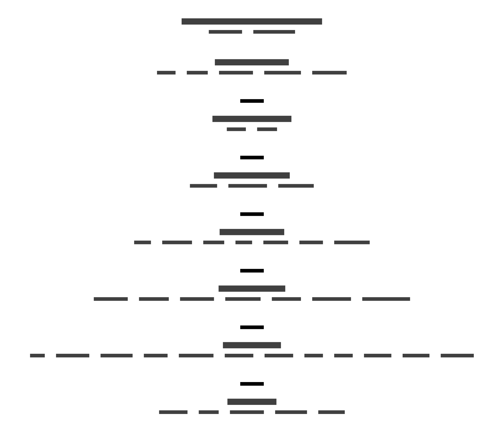

# Enterprise Brain: logical reference architecture

## 1. Framing

### What an enterprise brain is

An **enterprise brain** is the institutional memory-and-reasoning system of an organisation. It **captures the organisation's proprietary knowledge, finds and assembles the right context for any request, resolves which facts are true and where they came from, and reasons over them.** It does all of that resiliently, securely, lawfully, valuably, and at scale. An organisation with documents merely *has* knowledge; an enterprise brain can *reason from what it knows*.

This document is the **logical reference architecture** for that system. It is *logical* in the precise sense: it names **what the brain must be able to do** and the **contract each capability must honour**, without naming a single product, platform, or vendor. Any organisation can read it, place its own concerns onto it, and then realise it on whatever technology stack it already runs. A concrete realisation on a specific stack is a separate, downstream artefact (see §6 and the solution-architecture example in the [INDEX](INDEX.md)). It never lives inside this logical layer.

The architecture is organised as a **capability map** in the business-capability tradition: each capability is **named by the outcome it delivers** (not the process it runs), the set of capabilities is **mutually exclusive** (no function lives in two places) and **collectively exhaustive** (nothing required is missing), and each is **assessable for maturity**, so an organisation can overlay a heatmap of where it is strong, where it is weak, and where a gap is critical. That is View 1.

### The eval ⇄ architecture pairing

This architecture has a paired requirements document: the **enterprise-brain evaluation framework**, an independent specification of *what a fully-functional, trustworthy, resilient, secure, compliant, valuable, at-scale enterprise brain must satisfy and be measured on*. The relationship is deliberate and load-bearing.

> **The evaluation framework is the requirements specification. This architecture is the response. They cross-reference; they never duplicate.**

The evaluation framework asks, in seven quality lenses, *"is the brain a brain? is it trustworthy? resilient? secure? compliant? valuable? at scale?"* It defines forty-one measurable **dimensions**, each anchored to a recognised external standard. This architecture answers each of those dimensions with a capability that owns it. The **cross-walk** in §4 is the conformance instrument that proves the answer is complete: every evaluation dimension maps to a capability, and every capability traces back to the dimension(s) it satisfies. When the requirements change, the cross-walk is the drift detector that shows where the architecture must follow.

A reader who knows a concern from the evaluation framework, say *"how does the brain stop a confident-but-wrong write from corrupting its memory?"*, can find the capability that owns it (here, `C-G3.2`) through the cross-walk, read its contract, and see exactly what the architecture promises.

### The two-tier thesis as the architectural spine

Underneath the capability map runs a single architectural stance, and it is visible as the spine of the whole thing. An enterprise brain is built on **two tiers of reasoning**:

1. A **frontier orchestrator**: a general, commoditised, swappable reasoning model that decomposes a request, plans, and answers anything novel. By design it is kept un-specialised to the organisation, so it can be replaced whenever a better one appears.
2. A **specialist inventory**: a patiently-accumulated set of smaller models, each tuned on a slice of the organisation's **proprietary corpus** to do one recurring thing better and cheaper than the frontier. This inventory is the **moat**, the part a competitor cannot readily buy or replicate, because it is grown from knowledge only this organisation holds.

Between them sits a **hybrid router** that decides, per request, whether a specialist can answer or whether to escalate to the frontier. Underneath both sits a **durable-execution substrate** (so a multi-step reasoning act survives failure and is replayable) and the **proprietary corpus + evaluation substrate** (the knowledge the specialists are grown from, and the test sets that decide whether a specialist is good enough to deploy).

These five layers (channel, orchestrator, router, specialist inventory, durable substrate, corpus + evaluation) are not a separate document bolted onto the architecture. They **are** the architecture, expressed at capability grain. View 3 makes that explicit: it maps each thesis layer onto the capability groups, so a reader sees the thesis *is* the brain.

### The flywheel and the spine: two runtime companions to the thesis

The two-tier thesis names *what accumulates*: a specialist inventory grown from a proprietary corpus. Two further stances govern how that inventory behaves once the brain is **live and being used**, and both are visible in the capability map rather than bolted onto it.

**The experience flywheel** is the thesis turning under its own power. Every production interaction is a learning event: *capture → distil → eval-gate → promote → improve*. Captured with provenance and promoted only through a calibrated gate, a single interaction makes the brain better for the next one. It does this at three scales: within a session, across one user's sessions, and, the load-bearing one, across all users and domains. The discipline is one line: **capture everything, promote nothing unaudited.** The flywheel is not one box; it is expressed across capture (G1), provenance and contradiction-safety (G3), the specialist inventory as the adaptive form (GX), the consent/de-identification boundary and the human gate (G5), and the loop itself and its measurement (G7). §2 draws those threads together as one always-on loop and the cross-walk records its invariants. It is the *moat made dynamic*, the part a competitor cannot copy because they did not have the interactions.

**The deterministic spine** governs *what the brain may record as true*. Any state the brain acts on or presents as true must be a **deterministic function of observable, trustworthy events**, a rule over evidence, not a model's guess. The LLM generates and judges (gated and audited); a trained specialist captures patterns no rule reaches; but neither is ever the author of a claim the system acts on, or it will eventually confabulate one. This is why every capability below carries a **determinism class** (`deterministic-claim` / `retrieval` / `generative` / `trained`): the classification makes explicit, per capability, where truth is rule-derived and where a model judgment has been deliberately and visibly admitted. The default is the spine; reaching up a layer is earned, justified, and gated, and any state-claim that is *not* deterministic carries a one-line justification in its contract.

The two are duals. The flywheel says *capture every interaction and promote (gated)*; the spine says *what you promote into state must be deterministically grounded, never a confabulation*. Together they make the brain both **adaptive** (it learns from being used) and **trustworthy** (it never learns a falsehood into its system of record).

### Tech-agnosticism: declared and defended

This logical layer **names no product, platform, or vendor, anywhere.** That is a hard property, not a stylistic preference, and it is what makes the architecture portable. The defence is three rules, enforced throughout (and restated in full in §6):

- **No product names in the logical layer, ever.** A capability says *"retrieval blends complementary signals so that one signal's failure degrades rather than blanks the result"*, never the name of a search engine.
- **Quality attributes are stated as classes, not numbers.** A capability declares it must meet an *availability class* or a *latency class*; each adopting organisation sets the actual target. The architecture never says "99.9%", because that is an instance decision.
- **Contracts are invariants, realisable many ways.** *"A write that conflicts with trusted memory must not land silently"* can be built on countless technologies. The invariant is the commitment; the technology is the adopter's choice.

A concrete solution architecture on a real stack is valuable, but it is a *separate* artefact that links **to** this one and is linked **from** it, never absorbed into it. Keeping the two apart is the whole reason this layer is reusable across organisations.

## 2. The capability map

The brain decomposes into **eight architecture-native capability groups plus one cross-cutting band**, forty-three capabilities in total. The grouping follows **the life of a fact and the life of a query** through the system, in flow order:

> material **enters and is kept alive** (G1) → the right context is **found and assembled** (G2) → its **trust is resolved** (G3) → a request is **reasoned about and routed** (GX, cross-cutting) → the system is **defended** against attack and unauthorised access (G4) → it is **governed** so a regulator can audit it (G5) → it is **operated** resiliently and economically at scale (G6) → and it **proves its value and learns** from use (G7).

| # | Group | The function it owns |
|---|---|---|
| **G1** | **Knowledge Ingress & Lifecycle** | Material enters the brain and is kept current, conformant, and garbage-collected over time |
| **G2** | **Retrieval & Context Composition** | The right context is found and assembled within a budget for reasoning |
| **G3** | **Trust & Provenance** *(the moat)* | A fact's truth, conflicts, and origin are resolved and reconstructable |
| **GX** | **Reasoning & Orchestration** *(cross-cutting)* | A request is decomposed, routed, and answered: frontier orchestrator + specialist inventory |
| **G4** | **Security & Access Control** | The brain resists attack and enforces who can see and do what |
| **G5** | **Governance & Compliance** | The brain is auditable, validated, and lawful, the regulator's view |
| **G6** | **Runtime & Operations** | The brain stays available, fast, affordable, observable, and isolated at scale |
| **G7** | **Value & Feedback** | The brain proves it adds value, gets used, and learns from correction |

The cross-cutting band **GX** sits *between* retrieval (G2) and the answer, drawing on trust (G3) as a precondition and constrained by runtime budgets (G6) and governance oversight (G5). It is the two-tier architecture itself, the reasoning spine every quality group constrains.

> **Reading a capability.** Each capability below is a **logical contract** with this shape:
> **intent** (the outcome) · **logical contract** (inputs / outputs / invariants & preconditions, the MUSTs that any realisation has to honour) · **quality attributes** (as classes) · **determinism class** (`deterministic-claim` / `retrieval` / `generative` / `trained`, which layer of the deterministic spine the capability's output belongs to; the default is `deterministic-claim`, and any other class carries a one-line justification, see §1) · **eval dimension(s) satisfied** (the requirement it answers) · **runtime primitive(s)** (the reusable building blocks it draws on; the catalogue is named at first use below) · **dependencies** (other capabilities it needs) · **n=1-vs-enterprise band** (whether the capability fully bites a single-author instance, or is structurally deferred until the brain has many users, see §5).

> **Quality-attribute classes** (each organisation sets the number): *Availability · Latency · Durability · Isolation · Auditability · Freshness · Integrity · Confidentiality · Cost-efficiency · Explainability.*

> **Runtime primitives** (the reusable how-vocabulary the contracts draw on, named once here): **P1** two-layer contract (composition decides *what*, runtime decides *how*) · **P2** the reliability/efficiency/scalability/trust operating dimensions · **P3** state separation (the store is authoritative, not the model) · **P4** execution-isolation ladder · **P5** budgets enforced before the call · **P6** timeouts / retries / circuit-breakers · **P7** policy gateway (the control point on every guarded path) · **P8** graceful-degradation mode catalogue · **P9** the context/token pipeline (collect → rank → compress → budget → assemble) · **P10** closure-as-evidence (an action closes only when its gate verdict returns) · **P11** two trace streams (composition + runtime) made queryable · **P12** the versioned capability descriptor / model card · **P13** tiered memory (short-term working memory + authoritative long-term store) · **P14** runtime mode mirrors the declared composition shape.

### G1: Knowledge Ingress & Lifecycle

#### `C-G1.1` Capture proprietary knowledge
- **Intent.** Systematically bring the organisation's proprietary material into the brain with breadth and provenance-at-capture, so the corpus is an institutional asset and not a scatter of documents.
- **Logical contract.** *Inputs:* source material (documents, records, conversations, structured feeds); a source classification; an originator/authority signal. *Outputs:* a captured artefact in the store, carrying origin metadata, a capture timestamp, and a classification, addressable by retrieval. *Invariants:* every captured artefact carries its provenance at capture (origin reconstructable later); capture is breadth-systematic (an enumerable ingress, not ad-hoc); nothing enters the trusted store without a classification.
- **Quality attributes.** Durability; Auditability; Integrity.
- **Determinism class.** `deterministic-claim`.
- **Eval dimension(s).** **A1** Capture.
- **Runtime primitives.** P13, P3.
- **Dependencies.** Feeds `C-G3.3` (provenance-in-record) and `C-G2.1` (retrieval indexes what is captured).
- **n=1 band.** In scope at n=1: breadth and provenance-at-capture bite a single author the moment the corpus is incomplete or unprovenanced.

#### `C-G1.2` Maintain corpus freshness
- **Intent.** Keep the brain from silently rotting: measure and bound staleness across the *whole* corpus, not just at the point of retrieval.
- **Logical contract.** *Inputs:* the corpus with per-artefact last-verified signals and criticality tiers; index timestamps; the query stream (for stale-retrieval detection). *Outputs:* a corpus-wide freshness signal, a coverage-drift figure (fraction past its criticality-tiered threshold), a stale-retrieval-rate figure, each trended. *Invariants:* freshness is measured over the whole corpus (including un-retrieved material), not only over what retrieval surfaces; a last-verified signal (distinct from last-edited) exists; staleness is surfaced, never silently served.
- **Quality attributes.** Freshness; Auditability.
- **Determinism class.** `deterministic-claim`.
- **Eval dimension(s).** **G8** Lifecycle & freshness.
- **Runtime primitives.** P11, P13.
- **Dependencies.** Consumes `C-G1.1`; informs `C-G3.1` (recency feeds the trust rule) and `C-G6.4` (corpus drift and quality drift are the same failure shape at two layers).
- **n=1 band.** In scope at n=1: the un-retrieved rotting majority bites without a population.

#### `C-G1.3` Sweep contradiction stock
- **Intent.** Bound the *accumulated stock* of latent contradictions (pairs of co-valid facts that conflict but never collided at write-time) by periodic full-corpus sweep.
- **Logical contract.** *Inputs:* the full corpus of co-valid facts; the same conflict-detection policy used at write-time (`C-G3.2`), applied pairwise. *Outputs:* a latent-contradiction stock count and its trend; a queue of surfaced latent conflicts for resolution. *Invariants:* the sweep is periodic and corpus-wide (not write-time-only); the stock trend must be shown flat or falling, not merely "the gate held N times".
- **Quality attributes.** Integrity; Auditability.
- **Determinism class.** `deterministic-claim`.
- **Eval dimension(s).** **G9** Contradiction stock.
- **Runtime primitives.** P13.
- **Dependencies.** Reuses the conflict logic of `C-G3.2`; feeds `C-G1.5`.
- **n=1 band.** In scope at n=1: latent contradiction stock is the dominant slow-decay mode for a single author over time.

#### `C-G1.4` Conform to ontology under evolution
- **Intent.** Keep the trust machinery firing when the schema itself evolves: measure conformance after a schema change and bound the blast radius before it lands.
- **Logical contract.** *Inputs:* the current schema (types/relations/rules); a proposed change; the existing artefact population. *Outputs:* a pre-change impact count (how many artefacts the change breaks); a post-change conformance rate; a migration that restores conformance within a bounded window. *Invariants:* a schema change computes its impact *before* it lands; residual non-conformance is surfaced, never silent (a non-conforming artefact whose trust fields no longer parse must be flagged, not quietly trusted).
- **Quality attributes.** Integrity; Auditability.
- **Determinism class.** `deterministic-claim`.
- **Eval dimension(s).** **G10** Ontology conformance (the conformance half).
- **Runtime primitives.** P12, P11.
- **Dependencies.** Underpins `C-G3.1`/`C-G3.2`/`C-G3.3` (all read schema-defined trust fields).
- **n=1 band.** In scope at n=1: a schema change can silently stop the single author's trust rules from firing on legacy artefacts.

#### `C-G1.5` Govern knowledge lifecycle
- **Intent.** Run an enforced (not advisory) loop that identifies obsolete or non-conforming knowledge and acts on it (archive, supersede, re-verify), so curation is a process, not a hope.
- **Logical contract.** *Inputs:* the freshness signal (`C-G1.2`), contradiction stock (`C-G1.3`), conformance rate (`C-G1.4`), per-artefact criticality + retention class; a human-approval gate. *Outputs:* proposed lifecycle actions (archive / supersede / re-verify), each human-gated; a knowledge-debt ratio (stale + contradictory + non-conforming + orphaned over total), trended. *Invariants:* obsolescence handling is a *running scheduled* loop, not a one-off; a lifecycle action that removes or supersedes content is provenance-bearing and reversible-by-record; the debt ratio is a single trended figure.
- **Quality attributes.** Auditability; Freshness; Integrity.
- **Determinism class.** `deterministic-claim`.
- **Eval dimension(s).** **G10** Ontology conformance (the knowledge-debt half).
- **Runtime primitives.** P13, P10.
- **Dependencies.** Consumes `C-G1.2`/`C-G1.3`/`C-G1.4`; shares the human-gate pattern with `C-G3.2` and `C-G5.2`.
- **n=1 band.** In scope at n=1 for the decay it bounds; the enforced-cadence discipline is cheap to declare now and bites harder multi-author.

### G2: Retrieval & Context Composition

#### `C-G2.1` Retrieve relevant context
- **Intent.** Pull the *right* context for a request, measured by retrieval quality (single-fact and multi-hop), not by corpus size.
- **Logical contract.** *Inputs:* a query/request; the indexed corpus; an access context (who is asking, in what role/risk-tier). *Outputs:* a ranked set of candidate context units, each carrying its source identity and trust signals, filtered to what the requester may see. *Invariants:* retrieval blends complementary signals (semantic + lexical + relational) so a single signal's failure degrades rather than blanks the result; retrieval respects the access filter (`C-G4.1`) before returning; quality is measured on a fixed question set, not asserted.
- **Quality attributes.** Latency; Availability; Confidentiality; Integrity.
- **Determinism class.** `retrieval`. The defining output is a ranked candidate set from blended semantic + lexical + relational signals over the corpus (statistical surfacing where relevance cannot be enumerated); the access filter and the quality measurement are rule-based.
- **Eval dimension(s).** **A2** Retrieval.
- **Runtime primitives.** P9, P13.
- **Dependencies.** Consumes `C-G1.1`; gated by `C-G4.1`; feeds `C-G2.2`.
- **n=1 band.** In scope at n=1: retrieval quality bites the single author on every query.

#### `C-G2.2` Compose context for reasoning
- **Intent.** Assemble retrieved context into a deterministic, budgeted, structured prompt the reasoner can reliably attend to: the right slots, in the right order, within a token budget.
- **Logical contract.** *Inputs:* the ranked candidates from `C-G2.1`; the active governing constraints (principles/rules); a token budget; the request. *Outputs:* a structured context with named slots (governing constraint > primary fact > supporting > flagged-conflict), high-signal content at the boundaries, within budget. *Invariants:* assembly is deterministic and budgeted (never a flat blob, never unbounded); trust-flagged content (e.g. a contradiction-flagged fact from G3) is *labelled* in the assembled context, not silently mixed in; the budget is enforced before assembly completes.
- **Quality attributes.** Latency; Cost-efficiency; Explainability.
- **Determinism class.** `deterministic-claim`. Assembly is deterministic and budgeted by rule (the contract requires it).
- **Eval dimension(s).** **A2** Retrieval (the composition half: supports A2; `C-G2.1` is the home owner).
- **Runtime primitives.** P9, P5.
- **Dependencies.** Consumes `C-G2.1`; reads trust flags from G3; constrained by `C-G6.7` (budget); feeds `C-X1`.
- **n=1 band.** In scope at n=1: mis-assembly (lost-in-the-middle, over-budget) degrades every answer.

### G3: Trust & Provenance *(the moat)*

#### `C-G3.1` Resolve source of truth
- **Intent.** When two sources conflict, resolve which one wins by an explicit trust rule (recency / authority), so a golden source beats a stale document by rule, not by luck.
- **Logical contract.** *Inputs:* candidate facts with their source identity, authority signal, and validity time (recency); the trust rule. *Outputs:* the resolved fact plus the rule that selected it (recoverable), with superseded facts retained but marked. *Invariants:* resolution is by declared rule, not by retrieval order; recency requires a validity-time anchor (a fact must carry *when it became true*); supersession is declared, not inferred silently.
- **Quality attributes.** Integrity; Auditability; Freshness.
- **Determinism class.** `deterministic-claim`. Resolution is by a declared trust rule over recency/authority, never by retrieval order (the head of the spine).
- **Eval dimension(s).** **B1** Source truth + **B4** Deterministic-claim integrity *(the spine that resolves which fact is true also guards that the claim is rule-derived, not model-authored)*.
- **Runtime primitives.** P13, P9.
- **Dependencies.** Reads freshness from `C-G1.2` and schema-defined fields from `C-G1.4`; feeds `C-G2.1` ranking and `C-G3.2`.
- **n=1 band.** In scope at n=1: a single author served a stale-but-confident fact is the live failure.

#### `C-G3.2` Hold contradiction-unsafe writes
- **Intent.** A write that conflicts with trusted memory is held for a human regardless of model confidence: the maker-checker control rendered into the memory layer, non-bypassable.
- **Logical contract.** *Inputs:* a proposed write; the current trusted state; the conflict-detection policy. *Outputs:* either a clean landed write, or a *held* write queued for human adjudication with the conflict surfaced and the override (when granted) recorded with its reason. *Invariants:* a conflicting write **MUST NOT** land silently (confidence does not buy a bypass); the hold is structurally non-bypassable (the gate is the only write path); an override is a recorded human act, not a silent merge.
- **Quality attributes.** Integrity; Auditability; Confidentiality.
- **Determinism class.** `deterministic-claim`. The conflict-hold gate fires by rule and is non-bypassable; confidence does not buy a bypass.
- **Eval dimension(s).** **B2** Contradiction safety.
- **Runtime primitives.** P7, P10, P3.
- **Dependencies.** Reads the resolution of `C-G3.1`; its conflict logic is reused by `C-G1.3`; shares the human-gate pattern with `C-G5.2`.
- **n=1 band.** In scope at n=1: a single confident author silently overwriting trusted memory is the exact failure the gate exists to stop.

#### `C-G3.3` Bind provenance into the record
- **Intent.** Make origin and any override reconstructable from the *record itself*, not a side log that can drift or be lost.
- **Logical contract.** *Inputs:* a captured/written artefact; its origin, authorship, validity time, and any override decision. *Outputs:* the artefact with provenance bound *in-record* (origin + override + validity reconstructable from the artefact alone). *Invariants:* provenance lives in the record, not beside it; an override recorded by `C-G3.2` is bound into the record it modifies; provenance is written unconditionally (not best-effort).
- **Quality attributes.** Auditability; Integrity; Durability.
- **Determinism class.** `deterministic-claim`.
- **Eval dimension(s).** **B3** Provenance in artefact.
- **Runtime primitives.** P11, P10.
- **Dependencies.** Consumes `C-G1.1` and `C-G3.2`; feeds `C-G5.3` (audit reconstruction reads in-record provenance).
- **n=1 band.** In scope at n=1: a single author cannot reconstruct their own past decision without it.

### GX: Reasoning & Orchestration *(cross-cutting: the two-tier thesis)*

> The two capabilities below carry the architectural spine. By design they **own no eval dimension**: they are the reasoning tier the evaluation framework measures *through*, not a graded line. Each *supports* dimensions owned elsewhere; the cross-walk records that with support edges.

#### `C-X1` Orchestrate and route reasoning
- **Intent.** Decompose a request and decide, per call, whether to answer with a specialist or the frontier orchestrator: the hybrid router that governs escalation.
- **Logical contract.** *Inputs:* the request + composed context (`C-G2.2`); the specialist inventory's capability signatures (`C-X2`); a confidence signal; a cost budget; an audit class. *Outputs:* a routing decision (specialist *or* frontier) with the reason recorded; the answer; an escalation event when no specialist fits or confidence is low. *Invariants:* the router *defaults* to a specialist where one fits and clears its gate, and *escalates* to the frontier on novel / low-confidence / out-of-corpus requests; the routing reason is recorded for audit; the frontier orchestrator is *never* fine-tuned (it stays a commoditised, swappable tier); routing honours the budget (`C-G6.7`) and the audit class (`C-G5.3`).
- **Quality attributes.** Cost-efficiency; Latency; Auditability; Explainability.
- **Determinism class.** `deterministic-claim`. The escalation policy (default to specialist, escalate on novel / low-confidence / out-of-corpus) is a declared rule; it consumes a confidence signal that may be model-derived, but the routing decision and its recorded reason are rule-based and auditable.
- **Eval dimension(s).** *Cross-cutting, owns none.* Supports **G1** (right-sizing the model is the cost lever), **A2** (consumes composed context), **F1** (routing to the right tier is a decision-quality lever).
- **Runtime primitives.** P1, P2, P5, P9, P11.
- **Dependencies.** Consumes `C-G2.2`; queries `C-X2`; gated by `C-G6.7`, `C-G5.2`, `C-G4.6`.
- **n=1 band.** Structurally deferred as a *multi-tier* router (single-tier/frontier-only is honest at n=1); the *contract* (the routing interface + escalation policy) is declared now so the specialist tier is not a retrofit.

#### `C-X2` Maintain the specialist inventory
- **Intent.** Register, version, eval-gate, and retire the specialist models trained on slices of the proprietary corpus: the patiently-accumulated institutional asset that is the moat.
- **Logical contract.** *Inputs:* a proprietary corpus slice; an eval set per specialist slot (the spec for "better"); a trained specialist artefact; the frontier baseline on the same slot. *Outputs:* a registered specialist with a model card + corpus card + eval card, a typed I/O signature exposed to the router, a version, and a promotion/retirement verdict. *Invariants:* a specialist enters the inventory **only** on a clean blind eval against the frontier on its slot (eval-before-deploy); each specialist carries builder-facing cards (model/corpus/eval) *and* a clean reader-facing typed interface (surfaces separated); a specialist is retired by router-policy update when the frontier overtakes it; the corpus slice's lineage is tracked.
- **Quality attributes.** Integrity; Auditability; Confidentiality.
- **Determinism class.** `trained`. The capability's defining subject is the inventory of fine-tuned specialist models (the moat) that capture patterns no rule reaches; the eval-gate, cards, versioning and retirement governance around them remain rule-based.
- **Eval dimension(s).** *Cross-cutting, owns none.* Supports **F5** (a specialist re-trained on captured corrections is adaptive feedback in inventory form) and **E5** (the specialist's eval card is independent-validation evidence).
- **Runtime primitives.** P12, P10, P13.
- **Dependencies.** Consumes the corpus (`C-G1.1`) and its lineage (`C-G3.3`); routed-to by `C-X1`; shares the independent-validation pattern with `C-G5.5`.
- **n=1 band.** Structurally deferred: an inventory is an accumulated asset (frontier-first, specialists-later). The cards schema + eval-before-deploy gate are declared now; the populated inventory is a later-stage concern.

### G4: Security & Access Control

#### `C-G4.1` Mediate access by need-to-know
- **Intent.** Enforce that access to retrieval and write follows role / workflow / risk-tier, on a verified server-side identity: need-to-know, not all-or-nothing.
- **Logical contract.** *Inputs:* a verified requester identity (server-side claim, never user-supplied); the requested operation + target; the access policy. *Outputs:* an allow/deny/redact decision, applied before retrieval returns or a write lands, with the decision logged. *Invariants:* the identity derives from a verified server-side claim, never a user-supplied value; access is checked *before* the data path, not after; least-privilege is the default.
- **Quality attributes.** Confidentiality; Isolation; Auditability.
- **Determinism class.** `deterministic-claim`. Allow/deny/redact is decided by policy rule on a verified server-side identity.
- **Eval dimension(s).** **D1** Permissions / access.
- **Runtime primitives.** P7.
- **Dependencies.** Gates `C-G2.1` and `C-G3.2`; precondition for `C-G6.12`.
- **n=1 band.** Structurally deferred (single-user): the gate must exist now so multi-tenant is not a retrofit; grading it failing at n=1 would be self-flagellation.

#### `C-G4.2` Resist prompt injection
- **Intent.** Withstand instructions hidden in retrieved or tool-returned content that try to hijack the reasoner's actions, measured as an attack-success rate, not assumed.
- **Logical contract.** *Inputs:* untrusted content on the tool/retrieval paths; the injection-defence policy; a defined attack suite. *Outputs:* a measured attack-success rate (guarded and unguarded baseline) on tool-using paths; neutralised or flagged injection attempts. *Invariants:* tool/retrieved content is treated as attacker-controlled by default; injection defence runs on both tool inputs and outputs; the attack-success rate is *measured*, with the unguarded baseline recorded so the delta is visible.
- **Quality attributes.** Integrity; Confidentiality; Auditability.
- **Determinism class.** `deterministic-claim`. The default-untrusted stance, the containment enforcement and the measured attack-success rate are rule-based; injection *detection* may employ a generative/trained classifier, but no model silently authorises an action.
- **Eval dimension(s).** **D2** Prompt-injection.
- **Runtime primitives.** P7.
- **Dependencies.** Protects `C-X1` and `C-G4.6`; fed by `C-G4.7` (red-team cadence supplies the suite).
- **n=1 band.** In scope at n=1: a single author retrieves a poisoned web page; "unknown attack-success rate" is the riskiest state for a tool-wired brain.

#### `C-G4.3` Resist knowledge poisoning
- **Intent.** Withstand crafted material planted in the corpus to dominate retrieval and corrupt answers, and adversarial writes that try to pass the trust gate.
- **Logical contract.** *Inputs:* a corpus that may contain crafted poison passages; a poison test set targeting known questions; the write path (`C-G3.2`) under *adversarial*, not merely honest, conflict. *Outputs:* a poison-retrieval rate and an answer-corruption rate on the test set, trended; the proportion of adversarial writes that reach the store. *Invariants:* the trust gate is stress-tested against *malicious* writes, not only honest conflicts, before any poisoning-resistant claim; poison resistance is measured on the real retrieval/write stack.
- **Quality attributes.** Integrity; Auditability.
- **Determinism class.** `deterministic-claim`. The adversarial stress of the trust gate and the measured poison-retrieval / answer-corruption rates are rule-based; poison *detection* may employ a trained classifier.
- **Eval dimension(s).** **D3** Retrieval/memory poisoning.
- **Runtime primitives.** P7, P13.
- **Dependencies.** Stresses `C-G3.2`; overlaps the sweep `C-G1.3`; fed by `C-G4.7`.
- **n=1 band.** In scope at n=1: a poisoned passage the brain will retrieve is a live single-user risk.

#### `C-G4.4` Contain sensitive-data egress
- **Intent.** Prevent secrets and regulated/personal data leaving via retrieval outputs, write artefacts, or tool-call payloads: runtime egress control, not just a commit-time deny-list.
- **Logical contract.** *Inputs:* outbound content on all egress surfaces (retrieval outputs, write artefacts, tool payloads); a planted-secret test set; the egress policy. *Outputs:* a measured leak rate (target: zero) on the test set; redacted/blocked egress on a hit. *Invariants:* egress is scanned at *runtime* across all three surfaces, not only at the source-control boundary; a privacy/personal-data block is a tested control; the target is zero egress.
- **Quality attributes.** Confidentiality; Auditability.
- **Determinism class.** `deterministic-claim`. Egress scanning and the redact/block decision are runtime policy rules with a measured zero-leak target; residual-PII *detection* may employ a trained classifier.
- **Eval dimension(s).** **D4** Secrets / personal-data egress.
- **Runtime primitives.** P7.
- **Dependencies.** Wraps `C-G2.1` outputs, `C-G3.2` write artefacts, `C-G4.6` tool payloads; relates to `C-G5.4` (erasure) and `C-G5.6` (residency).
- **n=1 band.** In scope at n=1: identifiable personal data is already present; egress bites a single author.

#### `C-G4.5` Attest the supply chain
- **Intent.** Verify provenance and integrity of the brain's loaded extensions (skills, tool servers, dependencies), so a malicious component cannot enter undetected.
- **Logical contract.** *Inputs:* the inventory of loaded extensions; available provenance + signature/pin signals; a tamper-evident registry. *Outputs:* the proportion attested (provenance + signature/pin verified); a flagged list of unattested components. *Invariants:* every loaded extension has a provenance record; signature/pin verification is applied where available; the attested proportion is a tracked metric.
- **Quality attributes.** Integrity; Auditability.
- **Determinism class.** `deterministic-claim`.
- **Eval dimension(s).** **D5** Supply-chain attestation.
- **Runtime primitives.** P12, P7.
- **Dependencies.** Constrains what `C-G4.6` may invoke; feeds `C-G5.6` (third-party register).
- **n=1 band.** In scope at n=1: loaded extensions with zero attestation is a likely exploit path even single-user; the full registry is a light declare-now.

#### `C-G4.6` Constrain tool agency
- **Intent.** Ensure every tool the brain can call runs under least privilege with a confused-deputy check: untrusted content cannot induce an unauthorised tool call.
- **Logical contract.** *Inputs:* the set of callable tools + their argument schemas; the requester's authority; a confused-deputy test per tool. *Outputs:* an allow/deny per tool-call against least-privilege; a tool-abuse attack-success rate; a count of tools with no gateway check. *Invariants:* each tool call is least-privilege-checked; a confused-deputy test exists per tool; no tool is callable without a gateway check.
- **Quality attributes.** Confidentiality; Integrity; Isolation; Auditability.
- **Determinism class.** `deterministic-claim`.
- **Eval dimension(s).** **D6** Excessive-agency / tool-abuse.
- **Runtime primitives.** P7, P4.
- **Dependencies.** Mediates `C-X1`'s tool use; protected by `C-G4.2`; constrained by `C-G4.5`.
- **n=1 band.** In scope at n=1: a confused-deputy exfiltration bites a single tool-wired author; multi-tenant tool RBAC is the deferred half.

#### `C-G4.7` Exercise adversarial assurance
- **Intent.** Run a scheduled adversarial test mapped to the standard attack categories, logged and fed back, so security is evidenced on a cadence, not asserted once.
- **Logical contract.** *Inputs:* the adversarial harness (injection + poisoning + egress + extraction cases); a schedule; the attack-category taxonomy. *Outputs:* a dated adversarial scorecard per run (categories covered / total, last-run recency), fed into governance. *Invariants:* the run is *scheduled* and recurs (phase-boundary / periodic), not one-off; results map to the standard category set and are logged as governance evidence.
- **Quality attributes.** Auditability; Integrity.
- **Determinism class.** `deterministic-claim`.
- **Eval dimension(s).** **E7** Red-team evidence cadence. *(The evaluation framework lists red-team cadence under its compliance lens; architecturally it is a security-assurance capability, so its single home is here in G4. The cross-walk records the group-crossing.)*
- **Runtime primitives.** P11, P7.
- **Dependencies.** Supplies the suites for `C-G4.2`/`C-G4.3`/`C-G4.4`; feeds `C-G5.1`.
- **n=1 band.** In scope at n=1 for the bite; the formal cadence is a declare-now discipline.

### G5: Governance & Compliance

#### `C-G5.1` Operate the AI management system
- **Intent.** Run monitoring as an audited Plan-Do-Check-Act loop with breach-triggered corrective action: the management system, not just a cadence on paper.
- **Logical contract.** *Inputs:* the monitoring signals (eval scores, healthcheck, drift, security evidence); a defined breach threshold; a corrective-action policy. *Outputs:* a running loop with at least one recorded breach→corrective-action instance; a halt rule that pre-empts feature work on breach. *Invariants:* the loop runs on an *enforced* cadence (a schedule that provably fires), not an aspiration; a breach triggers a defined corrective action that takes priority over growth work.
- **Quality attributes.** Auditability; Availability.
- **Determinism class.** `deterministic-claim`.
- **Eval dimension(s).** **E1** AI management system.
- **Runtime primitives.** P10, P11.
- **Dependencies.** Consumes `C-G6.2`/`C-G6.4` (signals), `C-G4.7` (security evidence), `C-G7.1` (value evidence); governs all of G6.
- **n=1 band.** In scope at n=1: without an enforced loop every layer below is theatre.

#### `C-G5.2` Assure human oversight
- **Intent.** Put a named human in or on the loop at decisions that move money or expose regulated data, with a working override and stop, and measured automation-bias.
- **Logical contract.** *Inputs:* a decision classified as money-moving / regulated-data-exposing; a named human authority; an override/stop mechanism. *Outputs:* a recorded human decision (or override/stop) at the gated point; an automation-bias measurement on seeded right/wrong outputs. *Invariants:* the decision is not solely-automated at gated points; the override and stop genuinely work and are exercised; the human is *named*, not nominal.
- **Quality attributes.** Auditability; Explainability.
- **Determinism class.** `deterministic-claim`. The gate-trigger classification (money-moving / regulated-data) fires by rule; the oversight act itself is a human decision, not a model's.
- **Eval dimension(s).** **E2** Human oversight.
- **Runtime primitives.** P10, P14.
- **Dependencies.** Instantiates the human-gate pattern shared with `C-G3.2` and `C-G1.5`; precondition for audit-class routing in `C-X1`.
- **n=1 band.** Mixed: in scope at n=1 on the write path (the maker-checker gate bites); structurally deferred on read-path decision oversight (multi-consumer); declare the gate now.

#### `C-G5.3` Reconstruct the decision record
- **Intent.** Make the proportion of decision-class answers *fully reconstructable from records alone* (query → context-versions → model/route → output → override), measured and high.
- **Logical contract.** *Inputs:* the read/retrieval path *and* the write path events; per-artefact provenance (`C-G3.3`); a decision-class taxonomy. *Outputs:* a measured audit-completeness coverage (% of decision-class answers reconstructable), trended; an evidence pack producible on demand for any one decision. *Invariants:* the *retrieval/read path is logged*, not just the write path; reconstruction draws from records alone, no tacit knowledge; coverage is measured, not assumed-because-capable.
- **Quality attributes.** Auditability; Durability.
- **Determinism class.** `deterministic-claim`.
- **Eval dimension(s).** **E3** Audit-log completeness & reconstructability.
- **Runtime primitives.** P11, P10.
- **Dependencies.** Consumes `C-G3.3` and the retrieval-access log (shared with `C-G7.2`); feeds `C-G5.5`.
- **n=1 band.** In scope at n=1: coverage (especially the read-path log) bites a single author who cannot reconstruct why an answer was given.

#### `C-G5.4` Enforce erasure and retention
- **Intent.** Erase a subject across *every* store (source, lexical index, vector index, graph, caches) within an SLA with proof, and enforce per-record retention class + TTL.
- **Logical contract.** *Inputs:* an erasure request for a subject; the full set of stores; per-record retention class + TTL; a lawful-basis-for-retention rule. *Outputs:* erasure across all stores with proof (re-query-empty + indistinguishability spot-check); retention enforced by class. *Invariants:* erasure propagates to *all* derived stores, not just source (a subject erased from source but resident in the vector index is not erased); the archive-not-delete convention is reconciled with storage-limitation via retention classes (declared lawful basis or erase); erasure is provable.
- **Quality attributes.** Confidentiality; Auditability; Durability.
- **Determinism class.** `deterministic-claim`.
- **Eval dimension(s).** **E4** Right-to-erasure & retention.
- **Runtime primitives.** P13, P3.
- **Dependencies.** Operates across `C-G1.1` capture stores and `C-G2.1` indexes; relates to `C-G4.4` and `C-G1.5`.
- **n=1 band.** In scope at n=1: identifiable personal data is present today, so erasure + retention are live obligations and archive-not-delete is in actual tension now.

#### `C-G5.5` Validate the brain as a model
- **Intent.** Put the brain (and every model/specialist it uses) on a risk-tiered inventory, and subject it to dated *independent* validation by a role separate from the builder, with ongoing-monitoring triggers.
- **Logical contract.** *Inputs:* the model/specialist inventory; the brain's measurable behaviours (retrieval quality, gate efficacy, answer correctness); a validator role separate from the builder. *Outputs:* a model inventory (fully inventoried, each risk-tiered); a dated independent-validation record per model; re-validation triggers. *Invariants:* validation is *independent* of the builder (the separate validator role is structural); every model including the brain itself is inventoried and risk-tiered; validation is dated and re-triggered on change.
- **Quality attributes.** Auditability; Integrity.
- **Determinism class.** `deterministic-claim`. The inventory, risk-tiering and dated independent-validation records are rule-bound; the validation may run model-judged evals, but the records and triggers are deterministic.
- **Eval dimension(s).** **E5** Model inventory & independent validation.
- **Runtime primitives.** P12, P10.
- **Dependencies.** Reads the specialist eval cards from `C-X2`; shares the independent-validation pattern with `C-X2`; the brain-level analogue of `C-X2`'s per-specialist eval.
- **n=1 band.** In scope at n=1 for the discipline (independent validation bites a single author serving a confident-wrong answer); the formal regulated inventory is a declare-now for the regulated-deployment case.

#### `C-G5.6` Honour residency and operational-resilience obligations
- **Intent.** Process in approved jurisdictions, classify and report ICT incidents on the regulatory clock, and manage provider-concentration risk (e.g. a single reasoning-model provider).
- **Logical contract.** *Inputs:* a residency policy (approved jurisdictions); an incident-classification runbook with the regulatory clock; a third-party/provider register with concentration assessment. *Outputs:* jurisdiction-conformant processing; classified+reported incidents within window; a provider register with at least one resilience test on the critical dependency. *Invariants:* processing stays within approved jurisdictions; incident classification/reporting honours the regulatory clock; provider concentration (a single model/embedder provider) is a registered, assessed risk.
- **Quality attributes.** Confidentiality; Availability; Auditability.
- **Determinism class.** `deterministic-claim`.
- **Eval dimension(s).** **E6** Residency & operational resilience.
- **Runtime primitives.** P12, P6.
- **Dependencies.** Reads `C-G4.5` for the provider register; the *operational* failures it targets (silent outage, provider concentration) are owned by `C-G6.1`/`C-G6.2`/`C-G6.5` and merely *referenced* here.
- **n=1 band.** Structurally deferred: residency / operational-resilience obligations bind an organisation, not a private instance; declare the runbook/register/jurisdiction so a regulated instance is not a retrofit. *(The underlying operational failures do bite at n=1, but are owned by G6, not here.)*

#### `C-G5.7` Bound cross-user promotion by consent and de-identification
- **Intent.** When experience learned from one user's interactions is promoted to improve the brain for *other* users (the experience flywheel's cross-user scale), carry only distilled, de-identified, consented signal, never one subject's raw data across the per-user boundary.
- **Logical contract.** *Inputs:* a promotion candidate distilled from a source user's interactions; the source's consent / lawful-basis record; a de-identification policy; a residual-identifier test set. *Outputs:* a promote/hold decision gated on consent + de-identification, with a measured residual-identifier leak rate (target zero) at the promotion boundary, and the decision recorded. *Invariants:* raw individual data **MUST NOT** cross the per-user boundary (only distilled, de-identified signal is promotable); promotion requires a lawful basis / consent that is *checked, not assumed*; the residual-identifier check is a tested control with a zero-leak target; child-facing and regulated domains raise this to a hard, human-gated control.
- **Quality attributes.** Confidentiality; Auditability; Integrity.
- **Determinism class.** `deterministic-claim`. The consent check and the promotion gate are rule-derived and the leak target is measured/zero; residual-identifier *detection* may employ a trained classifier, but no model decides unaudited that data is "safe enough" to promote.
- **Eval dimension(s).** **E8** Cross-user promotion privacy boundary.
- **Runtime primitives.** P7, P10, P13.
- **Dependencies.** Gates the cross-user scale of the flywheel (`C-G7.5`); reuses the egress-control pattern of `C-G4.4` and the erasure/retention machinery of `C-G5.4`; its promotion decisions are human-gated via `C-G5.2`.
- **n=1 band.** Structurally deferred: cross-user promotion needs a population to bite; declare the boundary now so the cross-user flywheel is never a privacy retrofit. The hardest unsolved piece, *what exactly may cross the boundary, and how it is proven safe*, is named here, not solved.

### G6: Runtime & Operations

#### `C-G6.1` Meet service-level objectives
- **Intent.** Declare and meet availability objectives for the two critical paths (retrieve, write) with an error budget and a breach policy.
- **Logical contract.** *Inputs:* availability-indicator definitions for retrieve + write; objective targets + window; an error-budget policy. *Outputs:* measured availability against objective; an error budget consumed/remaining; a breach policy that halts feature work when exhausted. *Invariants:* indicators are defined for both critical paths; the error budget has a *consequence* (breach pre-empts growth work); targets are declared even where measurement is deferred.
- **Quality attributes.** Availability; Auditability.
- **Determinism class.** `deterministic-claim`.
- **Eval dimension(s).** **C1** Availability & objectives.
- **Runtime primitives.** P2, P6.
- **Dependencies.** Consumes `C-G6.2` and `C-G6.11`; feeds `C-G5.1`.
- **n=1 band.** Structurally deferred for the *consequence* (unseen consumers deciding on a brain they cannot rebuild bites at scale); declare the targets now.

#### `C-G6.2` Detect silent failure
- **Intent.** Detect a silent dependency break (embedder, index, model) within a bounded mean-time-to-detect: no failure sits undetected.
- **Logical contract.** *Inputs:* the critical dependencies; a heartbeat/healthcheck probe; a bounded time-to-detect target. *Outputs:* a liveness signal per dependency (OK/FAIL), recorded; an alert on FAIL within the bound. *Invariants:* every dependency has a tripwire that *runs on a firing cadence*; a FAIL is visible (status/log/refusal), never a silent empty answer; the detect-time is bounded and the cadence is proven to fire.
- **Quality attributes.** Availability; Auditability.
- **Determinism class.** `deterministic-claim`.
- **Eval dimension(s).** **C2** Detection / time-to-detect.
- **Runtime primitives.** P6, P11.
- **Dependencies.** Feeds `C-G6.1`, `C-G6.5`, `C-G5.1`.
- **n=1 band.** In scope at n=1: a multi-week silent outage can hit a single author; "deferred because n=1" is the mis-grade to avoid.

#### `C-G6.3` Recover from store
- **Intent.** Rebuild the full brain from the source-of-truth within a bounded recovery time, with a bounded data-loss window, proven by a dated drill + post-rebuild eval.
- **Logical contract.** *Inputs:* the source-of-truth store; the rebuild procedure; recovery-time/recovery-point targets. *Outputs:* a timed rebuild-from-source with a recorded wall-clock recovery time and a verified post-rebuild eval score (rebuild is *correct*, not just fast); a recovery-point ≈ last commit/checkpoint. *Invariants:* derived indexes are rebuildable from the authoritative source (not themselves the source); the drill is *dated and timed*, not assumed; post-rebuild correctness is verified.
- **Quality attributes.** Durability; Availability; Integrity.
- **Determinism class.** `deterministic-claim`.
- **Eval dimension(s).** **C3** Recovery (recovery-time / recovery-point).
- **Runtime primitives.** P1, P13.
- **Dependencies.** Depends on `C-G3.3`/`C-G1.1`; verified by `C-G6.4` (post-rebuild eval).
- **n=1 band.** Structurally deferred for the consequence (declare targets now; the bite is at scale).

#### `C-G6.4` Detect quality drift
- **Intent.** Catch gradual answer-quality decay with no crash, by re-running a fixed golden set and alerting on regression versus a rolling baseline.
- **Logical contract.** *Inputs:* a fixed golden question set; a rolling quality baseline; a drift threshold + cadence. *Outputs:* an alert when quality drops past the threshold below baseline; a trended quality figure. *Invariants:* drift detection is distinct from binary error-detection (breakers catch crashes, not decay); the golden-set re-run is scheduled; a partial-failure mode (e.g. a retrieval signal silently collapsing) raises an alert, not a silent quality drop.
- **Quality attributes.** Integrity; Auditability; Freshness.
- **Determinism class.** `deterministic-claim`. The drift trip is a declared threshold rule against a rolling baseline; the golden-set may be scored by an LLM-judge, but the regression alert is rule-based.
- **Eval dimension(s).** **C4** Quality-drift tripwire.
- **Runtime primitives.** P11, P2.
- **Dependencies.** Consumes `C-G2.1` quality; sibling of `C-G1.2`; feeds `C-G5.1` and verifies `C-G6.3`.
- **n=1 band.** In scope at n=1: gradual golden-set regression bites a single author now.

#### `C-G6.5` Degrade gracefully
- **Intent.** When a dependency fails or a budget tightens, drop into a *named, declared* weaker mode (e.g. lexical-only retrieval when the embedder is down; read-only; refuse-and-say-so) rather than fail open with a confident wrong answer.
- **Logical contract.** *Inputs:* a failure/budget/safety trigger; a declared mode catalogue with named triggers. *Outputs:* a transition into a named degraded mode, labelled to the consumer, with the transition traced; recovery on trigger-clear or human sign-off. *Invariants:* every degraded mode is *named* with a *named trigger* (not ad-hoc); a degraded answer is *labelled* as degraded; the brain never silently fails open.
- **Quality attributes.** Availability; Integrity; Explainability.
- **Determinism class.** `deterministic-claim`.
- **Eval dimension(s).** **C5** Graceful degradation.
- **Runtime primitives.** P8, P6.
- **Dependencies.** Triggered by `C-G6.2` and `C-G6.7`; transitions traced via `C-G6.11`.
- **n=1 band.** In scope at n=1: an embedder-down silent blank bites a single author; the mode catalogue is buildable and testable now.

#### `C-G6.6` Rehearse failure
- **Intent.** Prove detection + degradation + recovery work by *deliberately* breaking a dependency against a steady-state hypothesis: a dated rehearsal, not an accidental outage.
- **Logical contract.** *Inputs:* a steady-state hypothesis (on user-facing measures); a fault to inject (break embedder / corrupt index / stall write queue); a minimised blast radius + abort. *Outputs:* a dated fault-injection result recording observed time-to-detect, degraded mode, and timed recovery against the hypothesis. *Invariants:* the fault is *engineered and dated* (not an accident); blast radius is minimised with an abort; the drill exercises the real detection/degradation/recovery path.
- **Quality attributes.** Availability; Auditability.
- **Determinism class.** `deterministic-claim`.
- **Eval dimension(s).** **C6** Fault-injection.
- **Runtime primitives.** P6, P8, P11.
- **Dependencies.** Exercises `C-G6.2`/`C-G6.5`/`C-G6.3`; feeds `C-G5.1` and `C-G5.6`.
- **n=1 band.** In scope at n=1: the single author has no *engineered* evidence recovery works; the drill is cheap and bites now.

#### `C-G6.7` Account for unit cost and budget
- **Intent.** Report cost-per-answer (and trend cost-per-outcome) and enforce a token/API/compute budget *before* the call, with a named breach action.
- **Logical contract.** *Inputs:* per-call consumption; declared budgets at instance/session/task; a breach action (escalate / downgrade / fail). *Outputs:* a cost-per-answer figure (queryable); a budget enforced before the call; a recorded breach event when a task is stopped/downgraded. *Invariants:* the budget is enforced *before* the model is invoked, not observed after; a breach triggers a named action (never silent continuation); cost-per-answer is capturable.
- **Quality attributes.** Cost-efficiency; Auditability.
- **Determinism class.** `deterministic-claim`.
- **Eval dimension(s).** **G1** Cost / unit-economics + **G2** Budget enforcement. *(One capability owns both the measure and the enforcement of the same concern, cost, per the lifecycle-atomic rule.)*
- **Runtime primitives.** P5, P2.
- **Dependencies.** Gates `C-X1` (routing honours the budget) and `C-G2.2`; a breach triggers `C-G6.5`.
- **n=1 band.** Mixed: unbounded-spend bites a single autonomous author (a runaway task burns real money); cost-allocation/showback is multi-tenant (deferred).

#### `C-G6.8` Meet latency objectives
- **Intent.** Declare and measure interactive latency as *percentiles* (time-to-first-token, end-to-end), not a mean, and track goodput.
- **Logical contract.** *Inputs:* per-request latency measurements; declared percentile targets; a goodput definition. *Outputs:* measured percentile latency against target; goodput (objective-meeting throughput); an alert on breach. *Invariants:* latency is expressed and measured as a percentile, never a mean; goodput (the objective-meeting throughput) is the real capacity figure.
- **Quality attributes.** Latency; Availability.
- **Determinism class.** `deterministic-claim`.
- **Eval dimension(s).** **G3** Latency percentile.
- **Runtime primitives.** P2, P11.
- **Dependencies.** Measured via `C-G6.11`; relates to `C-G6.9` and `C-G6.5`.
- **n=1 band.** Structurally deferred: at n=1 one human queries interactively and infrequently; a real enterprise gate, kept so an enterprise instance cannot skip it.

#### `C-G6.9` Exploit caching
- **Intent.** Use a caching layer (prefix and/or semantic) and report its hit-rate and the cost/latency it saves.
- **Logical contract.** *Inputs:* the query/prompt stream; a cache (prefix and/or semantic); a hit-rate target. *Outputs:* a measured cache hit-rate and the cost/latency saved. *Invariants:* cache hits are correctness-preserving (a semantic hit must not return a wrong-but-similar answer); the hit-rate is measured, not assumed.
- **Quality attributes.** Cost-efficiency; Latency; Integrity.
- **Determinism class.** `deterministic-claim`. The hit-rate and saving are measured by rule; a semantic-cache match must be correctness-preserving by gate (a similar-but-wrong hit is forbidden).
- **Eval dimension(s).** **G4** Cache effectiveness.
- **Runtime primitives.** P9, P2.
- **Dependencies.** Reduces `C-G6.7` cost and `C-G6.8` latency; measured via `C-G6.11`.
- **n=1 band.** Structurally deferred: caching pays off under repetitive multi-user load; declare the slot, low urgency at n=1.

#### `C-G6.10` Account for sustainability
- **Intent.** Produce an energy/carbon-per-answer figure (or a token→energy proxy) so the brain is reportable under sustainability regimes.
- **Logical contract.** *Inputs:* per-answer compute (tokens × model-class energy factor, or a measured energy signal); a carbon-intensity methodology. *Outputs:* an energy/carbon-per-answer figure, trended. *Invariants:* the figure is per functional unit (per answer), methodology-consistent; at minimum a token→energy proxy exists.
- **Quality attributes.** Auditability; Cost-efficiency.
- **Determinism class.** `deterministic-claim`.
- **Eval dimension(s).** **G5** Sustainability.
- **Runtime primitives.** P2, P11.
- **Dependencies.** Shares the per-answer measurement primitive with `C-G6.7`.
- **n=1 band.** Structurally deferred: one human querying infrequently; a real enterprise/ESG gate, kept so an enterprise instance cannot skip it.

#### `C-G6.11` Observe the running system
- **Intent.** Emit logs + metrics + distributed traces + *eval-in-production* under a consistent schema, with objectives alerted: the four observability pillars, not just per-query traces.
- **Logical contract.** *Inputs:* runtime + composition events; a telemetry schema; alert rules; an in-production eval stream. *Outputs:* logs, metrics, traces, and eval-in-production, queryable; alerts on objective breach. *Invariants:* all four pillars are present (the fourth, eval-in-production, is the one most often missing and the one that converts feedback from documentary to adaptive); traces are queryable; the schema is consistent.
- **Quality attributes.** Auditability; Availability.
- **Determinism class.** `deterministic-claim`.
- **Eval dimension(s).** **G6** Observability (four pillars).
- **Runtime primitives.** P11, P2.
- **Dependencies.** The substrate `C-G6.1`/`C-G6.4`/`C-G6.7`/`C-G6.8`/`C-G6.10` measure through; feeds `C-G5.1` and `C-G5.3`; its eval-in-production pillar is the mechanism behind `C-G7.5`.
- **n=1 band.** In scope at n=1 for the missing fourth pillar (eval-in-production drift bites a single author); system-wide multi-service metrics are the deferred half.

#### `C-G6.12` Scale with tenant isolation
- **Intent.** Hold cross-tenant leak rate at zero (isolation by construction, non-bypassable) and characterise the quality/latency degradation curve under concurrent load and corpus growth.
- **Logical contract.** *Inputs:* a verified per-tenant identity (from `C-G4.1`); the isolation model (dedicated or pooled-with-engine-filter); load + growth profiles. *Outputs:* a measured cross-tenant leak rate (target zero, by construction); a degradation curve at increasing scale and concurrency. *Invariants:* isolation is *by construction* and non-bypassable (the tenant identity is a verified server-side claim, never user-supplied); leak rate is zero, not low; degradation is characterised, not assumed flat.
- **Quality attributes.** Isolation; Confidentiality; Availability.
- **Determinism class.** `deterministic-claim`.
- **Eval dimension(s).** **G7** Scalability & isolation.
- **Runtime primitives.** P4, P14.
- **Dependencies.** Builds on `C-G4.1`; relates to `C-G5.6`.
- **n=1 band.** Structurally deferred: isolation needs many consumers to bite; the gate must exist now (isolation-by-construction is a design property, not a retrofit) so multi-tenant is not bolted on.

### G7: Value & Feedback

#### `C-G7.1` Measure decision quality
- **Intent.** Measure the *delta* on real decisions the brain informed versus a no-brain baseline, with zero high-confidence-wrong on audit-relevant queries: outcome, not mechanism.
- **Logical contract.** *Inputs:* a decision-quality set (real past decisions with later-verified outcomes); a no-brain baseline (or within-subject substitute at n=1); a high-confidence-wrong counter. *Outputs:* a measured decision-quality delta; a high-confidence-wrong rate (the guardrail counter-metric); a North-Star figure (trusted, provenanced answers that changed or confirmed a real decision per period). *Invariants:* value is measured against a *counterfactual*; the counter-metric (high-confidence-wrong) is tracked so optimising confidence does not game the North Star.
- **Quality attributes.** Auditability; Explainability.
- **Determinism class.** `deterministic-claim`. The decision-quality delta and the high-confidence-wrong counter are measured against verified outcomes by rule.
- **Eval dimension(s).** **F1** Outcome / decision-quality.
- **Runtime primitives.** P11, P10.
- **Dependencies.** Consumes the retrieval-access log (shared, `C-G7.2`/`C-G5.3`); reads provenance `C-G3.3`.
- **n=1 band.** In scope at n=1 (graded against the achievable within-subject substitute): high-confidence-wrong bites a single author without mercy; the between-subjects controlled trial half is structurally deferred (no control group at n=1).

#### `C-G7.2` Instrument adoption
- **Intent.** Measure how much real work invoked the brain versus bypassed it, and the abandoned-query rate: is it actually used.
- **Logical contract.** *Inputs:* a retrieval-access log (queries → results → use); the work-session stream. *Outputs:* % of sessions that invoked versus bypassed the brain; abandoned-query rate; query-diversity trend. *Invariants:* a retrieval-access log *exists* (the keystone primitive, without it adoption, value, and feedback-latency are all unmeasurable); capture is **provenance-complete**, every logged interaction carries enough provenance to trace *what* could be learned from it and *from where* (this is the experience flywheel's capture stage, on which auditable promotion depends, namely *capture everything*); usage is measured, not inferred from corpus size.
- **Quality attributes.** Auditability.
- **Determinism class.** `deterministic-claim`. The access log and the adoption figures are recorded and computed by rule over observed events.
- **Eval dimension(s).** **F2** Adoption / active-use.
- **Runtime primitives.** P11.
- **Dependencies.** The retrieval-access log it owns is the shared primitive behind `C-G7.1`, `C-G7.5` (the flywheel's capture stage), and `C-G5.3`.
- **n=1 band.** In scope at n=1: % of the author's *own* sessions that invoked versus bypassed (and abandoned-query rate) still bite; population adoption is the deferred half.

#### `C-G7.3` Calibrate appropriate reliance
- **Intent.** Measure over-reliance (wrong accepted / automation bias) and under-reliance (right rejected / algorithm aversion) on seeded right/wrong outputs, and the reported-versus-measured trust gap.
- **Logical contract.** *Inputs:* seeded correct/incorrect outputs; a two-step sequential protocol (decide cold → consult → revise); a trust self-report instrument. *Outputs:* over-reliance + under-reliance rates; the reported-trust versus measured-reliability gap. *Invariants:* reliance is measured on *seeded* outputs (both right and wrong) so both failure directions are observed; the protocol yields relative-reliance figures even with a single user.
- **Quality attributes.** Auditability; Explainability.
- **Determinism class.** `deterministic-claim`. Reliance is scored by rule against seeded known-right/known-wrong outputs; the rates are computed over observed actions.
- **Eval dimension(s).** **F3** Appropriate reliance & trust calibration.
- **Runtime primitives.** P11.
- **Dependencies.** Uses the explainability surface of `C-G7.4`; feeds `C-G5.2`.
- **n=1 band.** In scope at n=1: automation bias is *more* dangerous at n=1 (no second human to catch over-reliance).

#### `C-G7.4` Explain to the acting user
- **Intent.** Let a *non-expert* tell from the answer alone whether to act on it: user-facing explainability, distinct from auditor-facing provenance.
- **Logical contract.** *Inputs:* an answer + its trust/uncertainty signals; the acting user's context. *Outputs:* an answer a non-expert can act/not-act on correctly (a blind comprehension test passes); a contest path (a contested answer is human-reviewable, outcome recorded). *Invariants:* explainability is *user-facing* (act/don't-act decidable from the answer), not the auditor's provenance trail; a contest path exists and is exercised.
- **Quality attributes.** Explainability; Auditability.
- **Determinism class.** `generative`. The defining output is a user-facing explanation a non-expert can act/not-act on (open-ended generation no rule authors); the blind-comprehension pass/fail and the contest-path outcome are rule-recorded.
- **Eval dimension(s).** **F4** User-facing explainability.
- **Runtime primitives.** P9, P11.
- **Dependencies.** Consumes trust signals from G3; feeds `C-G7.3` and `C-G5.2`.
- **n=1 band.** In scope at n=1: if a single author cannot tell whether to act on an answer, the brain is not usable.

#### `C-G7.5` Close the feedback-to-improvement loop *(the experience flywheel)*
- **Intent.** Run the experience flywheel as one always-on loop (*capture → distil → eval-gate → promote → improve*) so a captured correction or insight *changes a later answer* (the brain wakes up smarter, not merely files the correction), and measure both the latency and the health of that loop.
- **Logical contract.** *Inputs:* captured interactions/corrections with provenance (`C-G7.2`/`C-G3.3`), each class-tagged; a calibrated, held-out eval-gate; a promotion path into the corpus / a fine-tune target (`C-X2`) / shared state; a detector for the next same-class event. *Outputs:* a measured feedback-to-improvement latency (between a correction captured and it changing a later answer); a same-class-recurrence count; a flywheel-health signal (capture completeness · promotion latency · eval-gate calibration · error-loop guard). *Invariants:* capture is automatic and complete while promotion is **gated** (*capture everything, promote nothing unaudited*); a candidate lands only after passing a **calibrated, held-out eval-gate** (graded never against the tuning set, because an uncalibrated gate turns an improvement loop into an error loop); promotion follows the **three-role discipline** (the agent that generates a candidate is never the trust-root that promotes it; a blind audit plus a separate adjudication gate the landing); a captured correction is *retrievable and surfaced at the point a later same-class request is handled* (corrections are queried during reasoning, not merely filed); a write that promotes a candidate into state is contradiction-safe (`C-G3.2`); a cross-user promotion passes the consent/de-identification boundary (`C-G5.7`); the latency is measured, with same-class recurrence as the failure signal.
- **Quality attributes.** Integrity; Auditability.
- **Determinism class.** `deterministic-claim`. Capture, surfacing, latency measurement and the promotion gate are rule-derived over observed events; the *distillation* of a candidate may use an LLM, but it is gated and audited, never the unguarded author of promoted state (the deterministic-spine dual of this loop, see §1).
- **Eval dimension(s).** **F5** Feedback-to-improvement latency & flywheel health (the loop is continuous, calibrated, and not an error loop; F5 graded continuously, not periodically).
- **Runtime primitives.** P13, P11, P10.
- **Dependencies.** Consumes the access log and provenance-complete capture (`C-G7.2`/`C-G3.3`); the adaptive mechanism is realised *in inventory form* by `C-X2` and the brain-level eval-gate by `C-G5.5`; the cross-user boundary is `C-G5.7`; contradiction-safety on promoted writes is `C-G3.2`; surfaced via `C-G6.11`'s eval-in-production pillar.
- **n=1 band.** In scope at n=1: the documentary-not-adaptive failure and an uncalibrated gate both bite a single author (a correction that did not prevent same-class recurrence); the per-session and per-user scales fully apply at n=1, the cross-user scale (with `C-G5.7`) is the deferred half.

### The experience flywheel: the always-on learning loop *(cross-cutting)*

Like the two-tier reasoning band (GX), the experience flywheel is a **cross-cutting expression** that runs *through* the groups rather than a single capability. It is the brain's defining runtime property: **every production interaction is a learning event** that, captured and promoted under gate, makes the brain better for the next one. The loop is one always-on cycle:

> **capture → distil → eval-gate → promote → improve**

Each stage has a home capability already in the map, which is why the flywheel is an *expression*, not a new group:

| Stage | What happens | Home capability |
|---|---|---|
| **capture** | every interaction logged with complete provenance | `C-G7.2` (the access-log keystone) + `C-G3.3` (provenance-in-record) |
| **distil** | mine the signal: what was learned, what failed, what is new | `C-G7.5` (consumes the log) |
| **eval-gate** | does this candidate actually improve the brain? a calibrated, held-out gate | `C-G5.5` (brain-level validation) + `C-X2` (per-specialist eval-before-deploy) |
| **promote** | land it (into the corpus, a fine-tune target, or shared state) contradiction-safe, consent-bounded, human-gated where stakes warrant | `C-G3.2` (contradiction-safe write) · `C-G5.7` (cross-user boundary) · `C-G5.2` (human gate) · `C-X2` (inventory form) |
| **improve** | the next interaction is better, measured | `C-G7.5` (latency + flywheel health) · `C-G7.1` (decision-quality delta) |

**The three scales** (a capability bites differently at each, see the n=1 calibration in §5):
1. **Per-session**: the brain grounds in what the request has already demonstrated within one interaction.
2. **Per-user, across sessions**: it accumulates a durable, provenance-traced model of *this* user and improves for them. *(Scales 1-2 are user-private state, fully in scope at n=1.)*
3. **Cross-user / cross-domain**: the load-bearing generalisation: distilled, de-identified, eval-gated signal from *every* user improves the brain for *everyone*, in *any* domain. This is the scale where `C-G5.7`'s consent/de-identification boundary becomes non-negotiable; it is structurally deferred until the brain has a population.

**The six invariants** that make the loop a self-reinforcing *improvement* loop rather than a self-reinforcing *error* loop, each owned by a capability, so the cross-walk can hold them:
1. **Provenance-complete capture**: `C-G7.2` / `C-G3.3`. Without it, promotion is unauditable.
2. **Eval-gate before promotion**: `C-G5.5` / `C-X2`. A held-out, *calibrated* gate decides; an uncalibrated gate is the error-loop hazard.
3. **Three-role promotion**: `C-G7.5` carries the full discipline (generate → blind-verify → adjudicate); `C-G5.5` supplies the structural builder-≠-validator half. The generator of a candidate is never its own trust-root.
4. **Contradiction-safety on promoted writes**: `C-G3.2`. A candidate that conflicts with trusted memory is held, not silently merged.
5. **The privacy / consent + de-identification boundary**: `C-G5.7`. Cross-user promotion carries no raw individual data.
6. **A human gate where stakes warrant**: `C-G5.2`. Autonomy on the capture side; gated on the promote side.

**The discipline in one line: capture everything, promote nothing unaudited.** The flywheel is the deterministic spine's dual (see §1): the spine bounds *what may be recorded as true*, the flywheel drives *what is learned from use*, and the promotion target always lands in the deterministic spine, never as a model's unguarded guess.

## 3. The cross-walk table (the conformance instrument)

The cross-walk binds **capability ↔ eval dimension ↔ runtime primitive**. It is how the architecture proves it answers its requirements. **H** marks the dimension's *home* owner (exactly one capability per dimension); **(s)** marks a capability that *supports* a dimension it does not own.

> **Coverage result: 41/41. Every one of the evaluation framework's 41 measurable dimensions has exactly one home capability, and every capability traces to ≥1 dimension (the two cross-cutting GX capabilities, and the composition half of A2 at `C-G2.2`, own no home dimension by design and connect via support edges). All 14 runtime primitives are drawn on by ≥1 capability. Two-way coverage is complete.** Every capability also carries a **determinism class** (§2): 40 of the 43 are `deterministic-claim`, with three deliberate departures: `C-G2.1` (`retrieval`), `C-X2` (`trained`), and `C-G7.4` (`generative`).

### 3.1 By capability: determinism class, home dimension(s), supported dimensions, primitives

The **Determinism** column carries the per-capability classification from §2 (the determinism-spine tag), so the cross-walk doubles as a determinism heatmap: where the brain records truth by rule (`deterministic-claim`), where it surfaces statistically (`retrieval`), where it admits a trained model (`trained`), and where it admits an open-ended LLM judgment (`generative`).

| Capability | Determinism | Home eval dimension(s) | Also supports | Runtime primitives |
|---|---|---|---|---|
| C-G1.1 Capture proprietary knowledge | deterministic-claim | A1 | E3(s), E4(s) | P13, P3 |
| C-G1.2 Maintain corpus freshness | deterministic-claim | G8 | B1(s), C4(s) | P11, P13 |
| C-G1.3 Sweep contradiction stock | deterministic-claim | G9 | D3(s) | P13 |
| C-G1.4 Conform to ontology under evolution | deterministic-claim | G10 (conformance) | B1(s), B2(s), B3(s) | P12, P11 |
| C-G1.5 Govern knowledge lifecycle | deterministic-claim | G10 (knowledge-debt) | G8(s), G9(s) | P13, P10 |
| C-G2.1 Retrieve relevant context | **retrieval** | A2 (retrieval) | B1(s) | P9, P13 |
| C-G2.2 Compose context for reasoning | deterministic-claim | none (supports A2) | A2(s), G2(s), B4(s) | P9, P5 |
| C-G3.1 Resolve source of truth | deterministic-claim | B1, B4 | A2(s), G8(s) | P13, P9 |
| C-G3.2 Hold contradiction-unsafe writes | deterministic-claim | B2 | D3(s), B4(s), F5(s) | P7, P10, P3 |
| C-G3.3 Bind provenance into the record | deterministic-claim | B3 | E3(s), B4(s), F5(s) | P11, P10 |
| **C-X1 Orchestrate and route** | deterministic-claim | *cross-cutting, none owned* | G1(s), A2(s), F1(s) | P1, P2, P5, P9, P11 |
| **C-X2 Maintain specialist inventory** | **trained** | *cross-cutting, none owned* | E5(s), F5(s) | P12, P10, P13 |
| C-G4.1 Mediate access by need-to-know | deterministic-claim | D1 | G7(s), E2(s) | P7 |
| C-G4.2 Resist prompt injection | deterministic-claim | D2 | D6(s) | P7 |
| C-G4.3 Resist knowledge poisoning | deterministic-claim | D3 | B2(s), G9(s) | P7, P13 |
| C-G4.4 Contain sensitive-data egress | deterministic-claim | D4 | E4(s) | P7 |
| C-G4.5 Attest the supply chain | deterministic-claim | D5 | E6(s) | P12, P7 |
| C-G4.6 Constrain tool agency | deterministic-claim | D6 | D2(s) | P7, P4 |
| C-G4.7 Exercise adversarial assurance | deterministic-claim | E7 (red-team cadence) | D2(s), D3(s), D4(s) | P11, P7 |
| C-G5.1 Operate the AI management system | deterministic-claim | E1 | C-all(s), F-all(s) | P10, P11 |
| C-G5.2 Assure human oversight | deterministic-claim | E2 | B2(s), F3(s), F5(s) | P10, P14 |
| C-G5.3 Reconstruct the decision record | deterministic-claim | E3 | F2(s) | P11, P10 |
| C-G5.4 Enforce erasure and retention | deterministic-claim | E4 | D4(s) | P13, P3 |
| C-G5.5 Validate the brain as a model | deterministic-claim | E5 | (paired with C-X2), F5(s) | P12, P10 |
| C-G5.6 Honour residency & op-resilience | deterministic-claim | E6 | C1(s), C2(s) | P12, P6 |
| C-G5.7 Bound cross-user promotion | deterministic-claim | E8 | F5(s), D4(s), E4(s) | P7, P10, P13 |
| C-G6.1 Meet service-level objectives | deterministic-claim | C1 | E6(s) | P2, P6 |
| C-G6.2 Detect silent failure | deterministic-claim | C2 | E6(s), C5(s) | P6, P11 |
| C-G6.3 Recover from store | deterministic-claim | C3 | none | P1, P13 |
| C-G6.4 Detect quality drift | deterministic-claim | C4 | G8(s), C3(s) | P11, P2 |
| C-G6.5 Degrade gracefully | deterministic-claim | C5 | C2(s) | P8, P6 |
| C-G6.6 Rehearse failure | deterministic-claim | C6 | E6(s) | P6, P8, P11 |
| C-G6.7 Account for unit cost and budget | deterministic-claim | G1 + G2 | none | P5, P2 |
| C-G6.8 Meet latency objectives | deterministic-claim | G3 | none | P2, P11 |
| C-G6.9 Exploit caching | deterministic-claim | G4 | G1(s), G3(s) | P9, P2 |
| C-G6.10 Account for sustainability | deterministic-claim | G5 | G1(s) | P2, P11 |
| C-G6.11 Observe the running system | deterministic-claim | G6 | C2(s), C4(s), F5(s) | P11, P2 |
| C-G6.12 Scale with tenant isolation | deterministic-claim | G7 | D1(s), E6(s) | P4, P14 |
| C-G7.1 Measure decision quality | deterministic-claim | F1 | E5(s) | P11, P10 |
| C-G7.2 Instrument adoption | deterministic-claim | F2 | E3(s), F5(s) | P11 |
| C-G7.3 Calibrate appropriate reliance | deterministic-claim | F3 | E2(s) | P11 |
| C-G7.4 Explain to the acting user | **generative** | F4 | E2(s) | P9, P11 |
| C-G7.5 Close the feedback-to-improvement loop *(the flywheel)* | deterministic-claim | F5 | G6(s) | P13, P11, P10 |

### 3.2 By eval dimension: every dimension's single home

| Eval dim | Home | Eval dim | Home |
|---|---|---|---|
| A1 Capture | C-G1.1 | E1 AI management system | C-G5.1 |
| A2 Retrieval | C-G2.1 (+C-G2.2) | E2 Human oversight | C-G5.2 |
| B1 Source truth | C-G3.1 | E3 Audit completeness | C-G5.3 |
| B2 Contradiction safety | C-G3.2 | E4 Erasure & retention | C-G5.4 |
| B3 Provenance | C-G3.3 | E5 Model inventory / validation | C-G5.5 |
| B4 Deterministic-claim integrity | C-G3.1 | E6 Residency & op-resilience | C-G5.6 |
| C1 Availability & objectives | C-G6.1 | E7 Red-team cadence | C-G4.7 |
| C2 Detection (time-to-detect) | C-G6.2 | E8 Cross-user promotion privacy | C-G5.7 |
| C3 Recovery (RT/RP) | C-G6.3 | F1 Decision quality | C-G7.1 |
| C4 Quality drift | C-G6.4 | F2 Adoption | C-G7.2 |
| C5 Graceful degradation | C-G6.5 | F3 Appropriate reliance | C-G7.3 |
| C6 Fault-injection | C-G6.6 | F4 User explainability | C-G7.4 |
| D1 Permissions | C-G4.1 | F5 Feedback latency & flywheel health | C-G7.5 |
| D2 Prompt-injection | C-G4.2 | G1 Cost / unit-economics | C-G6.7 |
| D3 Poisoning | C-G4.3 | G2 Budget enforcement | C-G6.7 |
| D4 Secrets / personal-data egress | C-G4.4 | G3 Latency percentile | C-G6.8 |
| D5 Supply-chain | C-G4.5 | G4 Cache effectiveness | C-G6.9 |
| D6 Excessive agency | C-G4.6 | G5 Sustainability | C-G6.10 |
| | | G6 Observability | C-G6.11 |
| | | G7 Scalability & isolation | C-G6.12 |
| | | G8 Lifecycle & freshness | C-G1.2 |
| | | G9 Contradiction stock | C-G1.3 |
| | | G10 Ontology conformance & debt | C-G1.4 + C-G1.5 |

Several dimension mappings are deliberately not one-to-one, and the architecture states why rather than hiding it: **A2** is answered by two capabilities (finding context, `C-G2.1`, and assembling it, `C-G2.2`: different machines, different contracts); **G1+G2** (cost and budget) are answered by one capability (`C-G6.7`, because you cannot enforce a budget you cannot measure); **G10** (ontology conformance and knowledge-debt) is split across two (`C-G1.4` for schema-conformance under change, `C-G1.5` for the standing debt loop); and **C-G3.1** owns both **B1** (source truth) and **B4** (deterministic-claim integrity): the same spine that resolves which fact is true also guards that the claim is rule-derived, not model-authored. **F5** (feedback latency & flywheel health) is a single dimension graded *continuously* rather than periodically: the experience flywheel's health (capture completeness, promotion latency, eval-gate calibration, error-loop guard) is the continuous form of the same loop whose latency F5 times. All of these over-cover rather than under-cover, so coverage is preserved.

### 3.3 Runtime-primitive coverage

All 14 primitives are drawn on; no capability is primitive-orphaned.

| Primitive | Drawn on by |
|---|---|
| P1 Two-layer contract | C-X1, C-G6.3 |
| P2 Operating dimensions | C-X1, C-G6.1, C-G6.4, C-G6.7, C-G6.8, C-G6.9, C-G6.10, C-G6.11 |
| P3 State separation | C-G1.1, C-G3.2, C-G5.4 |
| P4 Isolation ladder | C-G4.6, C-G6.12 |
| P5 Budgets before the call | C-G2.2, C-X1, C-G6.7 |
| P6 Timeouts / retries / breakers | C-G5.6, C-G6.1, C-G6.2, C-G6.5, C-G6.6 |
| P7 Policy gateway | C-G3.2, C-G4.1, C-G4.2, C-G4.3, C-G4.4, C-G4.5, C-G4.6, C-G4.7, C-G5.7 |
| P8 Graceful-degradation catalogue | C-G6.5, C-G6.6 |
| P9 Context/token pipeline | C-G2.1, C-G2.2, C-G3.1, C-X1, C-G6.9, C-G7.4 |
| P10 Closure-as-evidence | C-G1.5, C-G3.2, C-G3.3, C-X2, C-G5.1, C-G5.2, C-G5.3, C-G5.5, C-G5.7, C-G7.1, C-G7.5 |
| P11 Two trace streams | C-G1.2, C-G1.4, C-G3.3, C-X1, C-G4.7, C-G5.1, C-G5.3, C-G6.2, C-G6.4, C-G6.6, C-G6.8, C-G6.10, C-G6.11, C-G7.1, C-G7.2, C-G7.3, C-G7.4, C-G7.5 |
| P12 Versioned descriptor / model card | C-G1.4, C-X2, C-G4.5, C-G5.5, C-G5.6 |
| P13 Tiered memory | C-G1.1, C-G1.2, C-G1.3, C-G1.5, C-G2.1, C-X2, C-G3.1, C-G4.3, C-G5.4, C-G5.7, C-G6.3, C-G7.5 |
| P14 Runtime mirrors composition | C-G5.2, C-G6.12 |

## 4. The three views

### View 1: The capability map

The capability map is the executive-legible view: the eight groups as bands, the cross-cutting band across the top, and every capability as a cell. It is built to be **heatmapped**: overlay maturity (how well you do it), criticality (how much it matters), or the eval scorecard (how it grades) onto the cells and the gaps light up. A reader who knows a concern can find the cell that owns it here, then read its contract in §2.

*Source (canonical):* [diagrams/view1-capability-map.d2](diagrams/view1-capability-map.d2), rendered to the SVG above via the pinned d2 binary (`d2 --layout elk`) per the living-architecture discipline.

*Legend.* Each subgraph is a capability **group**; each box is a **capability** (with its ID). The arrows show the canonical flow order (ingress → retrieval → trust → security → governance → operations → value); **GX** is dashed because it is cross-cutting: it sits above the flow, not inside it. Overlay maturity or criticality onto the boxes to turn this into a heatmap.

### View 2: Logical component + flow view

This view follows a request and a write through the brain's logical components, and shows the **trust gates** as inline controls on the paths where they fire. It is the two-tier thesis at component grain: a request is composed, then the router (`C-X1`) decides between the **specialist inventory** (`C-X2`) and the **frontier orchestrator**, all of it on a durable substrate, all of it grown from the corpus + evaluation substrate.

*Source (canonical):* [diagrams/view2-component-flow.d2](diagrams/view2-component-flow.d2), rendered to the SVG above via the pinned d2 binary.

*Legend.* Rectangles are logical components; the cylinder shapes are stores; the diamond (`C-X1`) is the **router decision**; the hexagon-style nodes (`{{ }}`) are the **inline trust gates** (access mediation, the contradiction-safe write gate, human oversight). Solid arrows are the main request path; dashed arrows are control, write-back, and substrate-hosting relationships. The router defaulting to a specialist and escalating to the frontier *is* the two-tier thesis; the write path passing through a non-bypassable gate *is* the trust moat.

### View 3: The two-tier expression (the thesis is the architecture)

This view makes the architectural spine explicit: it maps the five thesis layers onto the capability groups, so a reader sees the two-tier thesis *is* the brain, not a separate document. Reading top to bottom is reading the thesis; reading the right-hand column is reading which capabilities realise each layer.

*Source (canonical):* [diagrams/view3-two-tier-expression.d2](diagrams/view3-two-tier-expression.d2), rendered to the SVG above via the pinned d2 binary.

*Legend.* The left-hand vertical stack is the thesis (channel → orchestrator → router → specialist inventory → durable substrate → corpus + eval). Each dashed edge points to the capability group(s) that **realise**, **constrain**, **trust-gate**, or **grade** that layer. The two cross-cutting capabilities (`C-X1` router, `C-X2` inventory) realise the middle two thesis layers directly; the eight quality groups wrap them. This is the same architecture as View 2, drawn so the thesis is the organising axis.

## 5. The n=1-vs-enterprise calibration

A reference architecture has to be honest about which capabilities a *small* instance can fully exercise and which only bite once the brain has many users and a regulated footprint. This calibration is **inherited from the evaluation framework**: its rule is that a capability whose failure needs many consumers to bite is **structurally deferred** (declare the contract, defer enforcement), while a capability whose failure bites a single confident author is **fully in scope** even at n=1. The point is so that **any instance can grade itself honestly**: a one-author instance is not failing because it has no multi-tenant isolation traffic; it is correctly *deferring* that capability while declaring the gate.

> **The discipline cuts both ways.** Deferring a capability is honest only if the *gate or contract* is declared now, so the deferred capability is never a retrofit. Marking a capability "in scope" is honest only if its failure genuinely bites a single author. Over-claiming a capability you cannot exercise is as dishonest as ignoring one you can.

**Fully in scope at n=1** (these bite a single confident author and must be exercised, not deferred): capture and freshness (`C-G1.1`, `C-G1.2`), the contradiction sweep (`C-G1.3`), ontology conformance and lifecycle governance (`C-G1.4`, `C-G1.5`), retrieval and composition (`C-G2.1`, `C-G2.2`), all of trust (`C-G3.1`, `C-G3.2`, `C-G3.3`), prompt-injection / poisoning / egress / supply-chain / tool-agency / adversarial-assurance resistance (`C-G4.2`-`C-G4.7`), the management system (`C-G5.1`), audit reconstruction (`C-G5.3`), erasure and retention where personal data is present (`C-G5.4`), model validation as a discipline (`C-G5.5`), silent-failure detection (`C-G6.2`), quality-drift detection (`C-G6.4`), graceful degradation (`C-G6.5`), failure rehearsal (`C-G6.6`), the eval-in-production pillar of observability (`C-G6.11`), and all of value and feedback (`C-G7.1`-`C-G7.5`).

**Structurally deferred at n=1** (declare the contract/gate now; enforcement bites at scale): access mediation as live multi-tenant traffic (`C-G4.1`), the multi-tier router (`C-X1`) and the populated specialist inventory (`C-X2`), where frontier-first is the honest n=1 stance, residency and operational-resilience obligations that bind an organisation rather than a person (`C-G5.6`), the availability and recovery *consequences* (`C-G6.1`, `C-G6.3`; declare the targets), latency / caching / sustainability as enterprise gates (`C-G6.8`, `C-G6.9`, `C-G6.10`), tenant isolation under load (`C-G6.12`), and the cross-user promotion boundary (`C-G5.7`), where the flywheel's cross-user scale needs a population to bite, so the consent/de-identification gate is declared now and enforced when the brain has many users.

**Mixed** (part bites now, part defers): human oversight (`C-G5.2`: the write-path maker-checker gate bites at n=1; read-path decision oversight defers); cost and budget (`C-G6.7`: runaway spend bites a single author; cost-allocation defers); decision quality (`C-G7.1`: high-confidence-wrong bites now; the controlled-trial comparison defers); adoption (`C-G7.2`: the author's own usage bites; population adoption defers).

An organisation profiling this architecture reads its own situation against these bands: a single-author knowledge instance grades itself against the "fully in scope" set and *declares* the deferred set; a regulated multi-user deployment must turn the whole deferred set live.

## 6. How it stays tech-agnostic

Portability is a property the architecture has to actively keep, because the most common failure of a reference architecture is product names creeping into the logical layer until it silently becomes a description of one vendor's stack. Four enforced rules hold the line:

1. **No product, platform, or vendor names in the logical layer, ever.** A capability contract is written in terms of the function and the invariant ("retrieval blends complementary signals"), never the technology that provides it. This rule is checkable: read the logical layer and any product name is a defect.

2. **Quality attributes are stated as classes, not numbers.** Every capability declares the *class* of quality it must meet (availability, latency, durability, and the rest from §2's class list); the actual target number is set by each adopting organisation. The architecture never embeds a number, because a number is an instance decision, not a logical one.

3. **Solution mappings attach as separate artefacts and link OUT, never absorbed.** A concrete realisation of this architecture on a specific stack (which product provides retrieval, which provides the durable substrate, which provides the write gate) is a *solution-architecture* artefact in its own right. It references this logical layer and is referenced *from* it (see the [INDEX](INDEX.md)), but it never edits or pollutes it. The logical layer is the invariant; a solution mapping is one substitutable proof. Portability is *demonstrated* the moment a second mapping is expressible without changing a word of this layer, and it now is: the [portability proof](portability-proof.md) expresses two further realisations on distinct public-cloud archetypes with **zero edits** to this layer (the named stacks live there, not here).

4. **A worked solution example is referenced, not inlined.** The companion [solution-architecture example](solution-example-our-stack.md) realises this architecture on a concrete, named-technology stack (honest about what is built versus planned) as the anti-abstraction proof that every logical capability maps to a real component, and the [portability proof](portability-proof.md) sets it side by side with two further public-archetype realisations. Both are linked from the [INDEX](INDEX.md) and neither edits this layer. Keeping them separate is what lets this document remain readable by, and reusable for, any organisation.

The discipline is what earns the architecture its central claim: **state the capability once, logically and tech-agnostically, and any enterprise can stand up its own realisation against the same map.**
