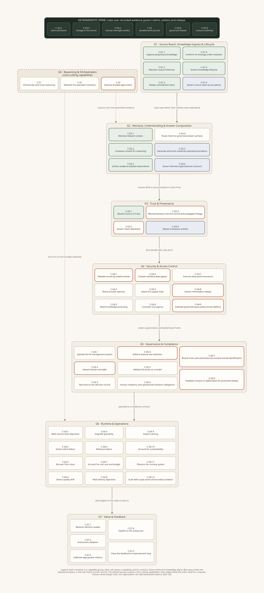
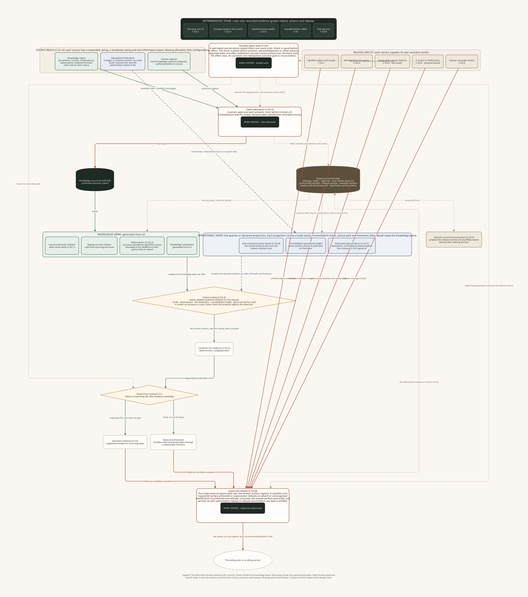
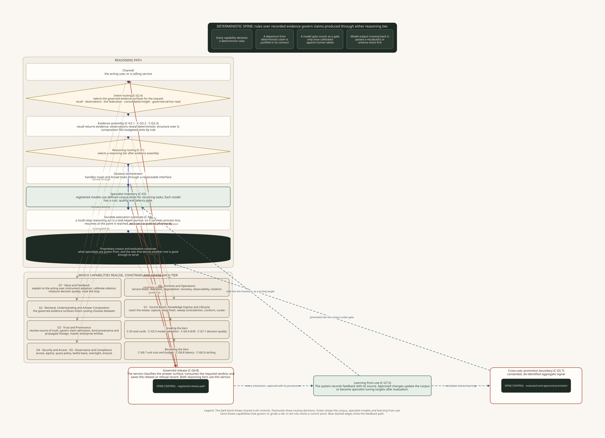
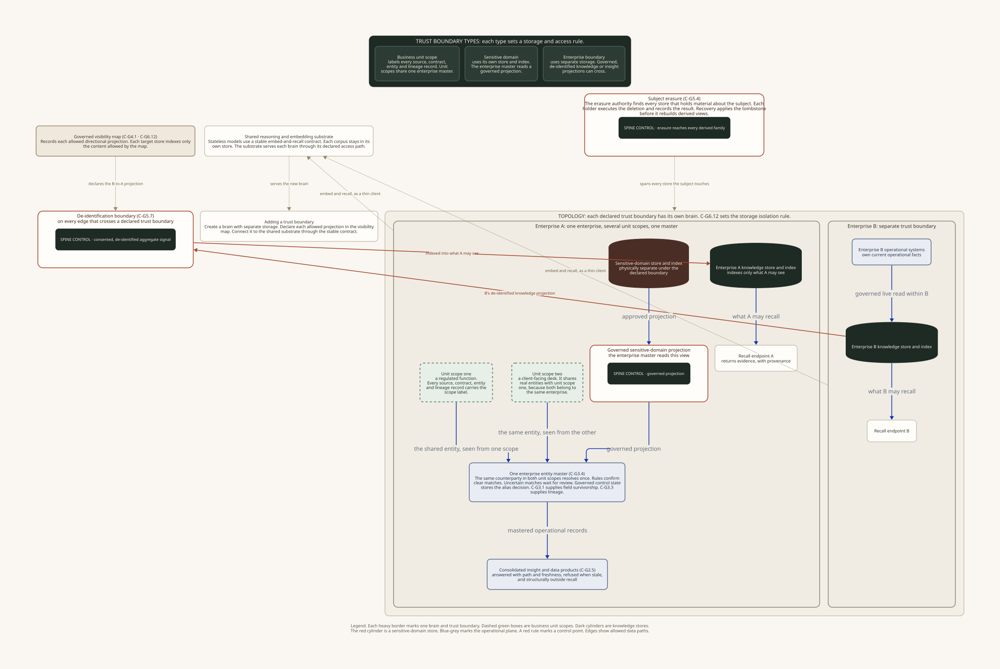
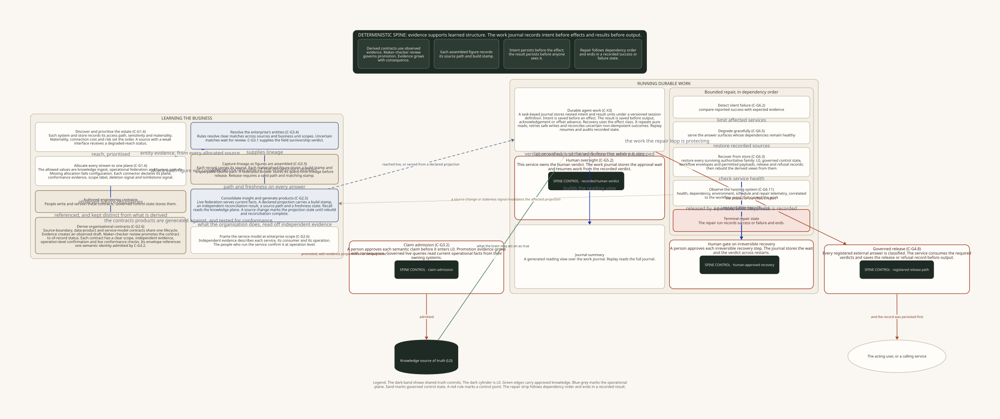

# Enterprise Brain: logical reference architecture

## 1. System model

An **enterprise brain** gives people and software governed access to an organisation's knowledge. It captures knowledge, finds evidence, supports reasoning, and controls the work that follows.

This document defines the logical capabilities and their contracts. A logical contract states the required behaviour and leaves product choices to the solution design.

The [Lexikon](https://antikas.io/writing/lexikon/) gives stable definitions for the enterprise brain, deterministic spine, and experience flywheel.

### The deterministic spine

Rules over recorded evidence decide what the system may store or present as true. The model can read, draft, summarise, explain, and propose within those rules.

A person approves semantic claims before they enter approved knowledge. Operational systems remain responsible for their current facts. Runtime policy decides access, release, and external effects.

Each capability has one determinism class:

- `deterministic-claim` uses rules over recorded events.
- `retrieval` ranks candidate evidence with statistical signals.
- `generative` creates open text or a proposed structural choice under deterministic controls.
- `trained` uses a specialist model that has passed its evaluation gate.

The runtime verifies the requester before model work begins. It carries the subject as trusted transport metadata. Prompt and tool arguments exclude fields that can replace that subject.

### Information classes

The architecture uses five information classes.

- **Approved knowledge (L0)** holds semantic claims admitted by a person.
- **Operational source authority** holds current facts in the systems that own them.
- **Governed control state** holds schemas, policies, registries, workflow events, verdicts, lineage stamps, release records, and serving status.
- **Knowledge-derived views** include indexes, graphs, observations, and summaries built from approved knowledge.
- **Operational-derived views** include entity masters and data products built from operational sources and governed control state.

Every derived view records its sources. A materialised operational view also records its build time, reconciliation result, path, and freshness limit.

### Evidence and reasoning

Recall returns admitted claims and their provenance. Observations describe patterns found across admitted evidence. Algorithms decide the structure of an observation. Constrained narration explains that structure from cited evidence.

Intent routing selects the evidence surfaces for a request. Reasoning routing then selects a general model or a registered specialist. The system records both decisions.

Long-running work uses a durable task journal. Intent is recorded before an external effect. The result is recorded before output begins. Approval waits and effect settlement survive process loss.

### Release and learning

One release service handles every external answer. It checks the subject, access, protection class, minimisation, lawful basis, query policy, and any required human verdict. It records release or refusal before sending data.

The experience flywheel captures interactions with provenance, distils candidate lessons, evaluates them, and promotes approved improvements. Claim admission controls promotion into approved knowledge. Privacy controls govern learning across users and domains.

### Trust boundaries

Business units inside one enterprise use scope labels and can share one enterprise entity master. A sensitive domain can use a separate store and index. The master reaches that domain through a governed projection.

Separate enterprises use separate storage. A directional visibility map controls governed projections between them. Shared reasoning services keep corpus state outside the shared runtime.

## 2. The capability map

Each capability has one owner and one contract. Quality attributes state the property that needs a local target. The [evaluation framework](eval/evaluation-framework.md) defines the requirement criteria and evidence.

### G1: Source reach, knowledge ingress and lifecycle

#### `C-G1.1` Capture proprietary knowledge
- **Intent.** Capture proprietary material with its origin, time, classification, and source route.
- **Logical contract.** Inputs are documents, records, conversations, feeds, and human submissions. The output is a staged candidate or payload. `C-G3.2` owns semantic claim admission. Missing or uncertain classification sends the candidate to review.
- **Quality attributes.** Durability; Auditability; Integrity.
- **Determinism class.** `deterministic-claim`.
- **Eval dimension(s).** **A1** Capture.
- **Runtime primitives.** P13, P3.
- **Dependencies.** Consumes source routing from `C-G1.6`. Supplies candidates to `C-G3.2`, provenance to `C-G3.3`, and admitted material to `C-G2.1`.
- **Deployment-scale applicability.** Applies from the first source and the first consumer.

#### `C-G1.2` Maintain corpus freshness
- **Intent.** Measure age and verification status across the whole knowledge corpus.
- **Logical contract.** Inputs are verification dates, materiality tiers, index times, and retrieval events. Outputs are corpus freshness, coverage drift, and stale retrieval measures. Threshold breaches create visible signals and lifecycle work.
- **Quality attributes.** Freshness; Auditability.
- **Determinism class.** `deterministic-claim`.
- **Eval dimension(s).** **G8** Lifecycle and freshness.
- **Runtime primitives.** P11, P13.
- **Dependencies.** Consumes captured material from `C-G1.1`. Supplies freshness to `C-G3.1`, `C-G1.5`, and `C-G6.4`.
- **Deployment-scale applicability.** Applies from the first stored item because age changes without query traffic.

#### `C-G1.3` Sweep contradiction stock
- **Intent.** Find conflicting co-valid claims that missed the write-time claim gate.
- **Logical contract.** A scheduled sweep applies the conflict policy across the corpus. It outputs a conflict queue, stock measure, and trend. The review process records each resolution.
- **Quality attributes.** Integrity; Auditability.
- **Determinism class.** `deterministic-claim`.
- **Eval dimension(s).** **G9** Contradiction stock.
- **Runtime primitives.** P13.
- **Dependencies.** Reuses the conflict policy from `C-G3.2`. Supplies lifecycle work to `C-G1.5` and attack evidence to `C-G4.3`.
- **Deployment-scale applicability.** Applies to every long-lived corpus.

#### `C-G1.4` Conform to ontology under evolution
- **Intent.** Measure the effect of schema changes and restore conformance after change.
- **Logical contract.** Inputs are the current schema, a proposed change, and affected records. Outputs are an impact report, migration, and post-change conformance result. Schema changes complete after residual failures have owners and actions.
- **Quality attributes.** Integrity; Auditability.
- **Determinism class.** `deterministic-claim`.
- **Eval dimension(s).** *Supports* **G10**, **B1**, **B2**, and **B3**.
- **Runtime primitives.** P12, P11.
- **Dependencies.** Supplies valid trust fields to `C-G3.1`, `C-G3.2`, and `C-G3.3`. Supplies conformance measures to `C-G1.5`.
- **Deployment-scale applicability.** Applies whenever a schema or ontology can change.

#### `C-G1.5` Govern knowledge lifecycle
- **Intent.** Act on stale, conflicting, invalid, orphaned, or expired knowledge.
- **Logical contract.** Inputs are freshness, contradiction, conformance, ownership, retention, and materiality signals. Outputs are review, re-verification, supersession, archive, and erasure actions. Each consequential action carries an approval and audit record.
- **Quality attributes.** Auditability; Freshness; Integrity.
- **Determinism class.** `deterministic-claim`.
- **Eval dimension(s).** **G10** Ontology conformance and knowledge debt.
- **Runtime primitives.** P13, P10.
- **Dependencies.** Consumes `C-G1.2`, `C-G1.3`, `C-G1.4`, and source events from `C-G1.6`. Sends retention and erasure work to `C-G5.4`.
- **Deployment-scale applicability.** Applies from the first stored item and grows with corpus age.

#### `C-G1.6` Govern source reach across planes
- **Intent.** Map the estate and give every source stream a declared route, scope, and materialisation setting.
- **Logical contract.** Inputs are systems, stores, people, interfaces, sensitivity, materiality, cost, and risk. Outputs are an estate register, reach order, source contract, scope label, route, and change events. Missing route or materialisation settings fail configuration.
- **Quality attributes.** Integrity; Auditability; Confidentiality; Freshness.
- **Determinism class.** `deterministic-claim`.
- **Eval dimension(s).** *Supports* **A4** and **G8**.
- **Runtime primitives.** P7, P12, P13.
- **Dependencies.** Supplies routes to `C-G1.1`, source events to `C-G2.5`, and contract evidence to `C-G2.6`. `C-G4.1` and `C-G4.9` govern reads.
- **Deployment-scale applicability.** Applies to every source stream.

### G2: Retrieval, understanding and answer composition

#### `C-G2.1` Retrieve relevant context
- **Intent.** Return relevant approved evidence for a request.
- **Logical contract.** Inputs are a request, approved indexes, and access context. The output is a ranked set of evidence units with source identity and trust signals. Retrieval blends semantic, lexical, and relational signals and reports fixed-set quality measures.
- **Quality attributes.** Latency; Availability; Confidentiality; Integrity.
- **Determinism class.** `retrieval`. Ranking uses statistical signals because relevance cannot be fully enumerated. Access filters and quality measures remain rule based.
- **Eval dimension(s).** **A2** Retrieval.
- **Runtime primitives.** P9, P13.
- **Dependencies.** Consumes admitted material from `C-G1.1` and access decisions from `C-G4.1`. Supplies evidence to `C-G2.2`.
- **Deployment-scale applicability.** Applies to every retrieval request.

#### `C-G2.2` Compose context for reasoning
- **Intent.** Build a structured evidence package within a declared token budget.
- **Logical contract.** Inputs are ranked evidence, governing rules, trust flags, the request, and a budget. The output uses named slots and recorded ordering. The composer labels conflicts and records truncation before model work begins.
- **Quality attributes.** Latency; Cost efficiency; Explainability.
- **Determinism class.** `deterministic-claim`.
- **Eval dimension(s).** *Supports* **A2**, **G2**, and **B4**.
- **Runtime primitives.** P9, P5.
- **Dependencies.** Consumes `C-G2.1`, trust flags from G3, and budgets from `C-G6.7`. Supplies context to `C-X1`.
- **Deployment-scale applicability.** Applies to every reasoning request.

#### `C-G2.3` Surface evidence-backed observations
- **Intent.** Describe recurring structure across admitted evidence.
- **Logical contract.** Algorithms create signatures, groups, identity, and lifecycle state. Constrained narration cites the evidence for each observation. Active status permits serving. Held and retired status block serving and embedding. Recomputation and non-consequential serving continue under algorithmic controls. Consequential use requires a verdict durably persisted through `C-X3`.
- **Quality attributes.** Integrity; Explainability; Auditability; Confidentiality.
- **Determinism class.** `generative`. Generation is limited to evidence-bound narration. Structure, identity, lifecycle, and serving controls use rules.
- **Eval dimension(s).** **A3** Structural understanding.
- **Runtime primitives.** P13, P9, P10, P11.
- **Dependencies.** Consumes admitted evidence, typed relations from `C-G3.3`, and oversight from `C-G5.2`. `C-G5.4` handles erasure. `C-G4.8` handles release.
- **Deployment-scale applicability.** Applies when the system creates observations.

#### `C-G2.4` Route intent to governed answer surfaces
- **Intent.** Select the registered evidence surfaces that can answer a request.
- **Logical contract.** Inputs are the request, subject scope, access context, and answer surface registry. Outputs are selected internal surfaces and a route record. A deterministic parser checks model proposals against the registry. External output uses `C-G4.8`.
- **Quality attributes.** Latency; Auditability; Explainability; Confidentiality.
- **Determinism class.** `generative`. A model can propose the route. Registry parsing, access checks, dispatch, and trace records use rules.
- **Eval dimension(s).** *Supports* **A2**, **A3**, **A4**, and **E9**.
- **Runtime primitives.** P1, P9, P11, P7.
- **Dependencies.** Consumes surfaces from `C-G2.1`, `C-G2.3`, `C-G2.5`, and `C-G2.6`. Query policy comes from `C-G4.9`.
- **Deployment-scale applicability.** Applies to every request that can use more than one evidence surface.

#### `C-G2.5` Generate and serve mastered operational products
- **Intent.** Serve current operational facts through federation or a declared materialisation.
- **Logical contract.** Inputs are operational sources, product contracts, the entity master, survivorship, lineage, and source events. Outputs carry source path, read mode, build time, freshness, and reconciliation. Source changes invalidate affected materialisations until rebuild and reconciliation finish.
- **Quality attributes.** Freshness; Integrity; Auditability; Availability.
- **Determinism class.** `deterministic-claim`.
- **Eval dimension(s).** *Supports* **A4**, **A2**, and **G8**.
- **Runtime primitives.** P3, P9, P11, P13.
- **Dependencies.** Consumes `C-G1.6`, `C-G2.6`, `C-G3.1`, `C-G3.3`, and `C-G3.4`. `C-G4.9` governs queries. `C-G4.8` governs release.
- **Deployment-scale applicability.** Applies whenever a request uses operational facts.

#### `C-G2.6` Govern derived organisational contracts
- **Intent.** Manage evidence-based descriptions of source boundaries, products, services, and operating arrangements.
- **Logical contract.** Inputs are authored targets or observed evidence from independent sources. Outputs use draft or active status. Operation owners confirm the description, maker-checker approves promotion, and live checks measure conformance. Each active envelope references one admitted semantic identity.
- **Quality attributes.** Integrity; Auditability; Explainability; Freshness.
- **Determinism class.** `generative`. Generation can propose a contract from evidence. Status, evidence checks, approval, identity, and conformance use rules.
- **Eval dimension(s).** *Supports* **A4** and **B3**.
- **Runtime primitives.** P12, P10, P7, P11.
- **Dependencies.** Consumes source and product evidence from `C-G1.6` and `C-G2.5`, lineage from `C-G3.3`, identity from `C-G3.2`, and oversight from `C-G5.2`.
- **Deployment-scale applicability.** Applies when the system derives a description of the organisation.

### G3: Trust and provenance

#### `C-G3.1` Resolve source of truth
- **Intent.** Apply declared authority and recency rules when sources conflict.
- **Logical contract.** Inputs are candidate facts, source authority, validity time, and trust rules. Outputs are the selected fact, rule, supersession record, and field-level survivorship verdict. Entity equivalence remains with `C-G3.4`.
- **Quality attributes.** Integrity; Auditability; Freshness.
- **Determinism class.** `deterministic-claim`.
- **Eval dimension(s).** **B1** Source truth and **B4** Deterministic claim integrity.
- **Runtime primitives.** P13, P9.
- **Dependencies.** Consumes freshness from `C-G1.2` and schema fields from `C-G1.4`. Supplies trust signals to retrieval, admission, and mastering.
- **Deployment-scale applicability.** Applies from the first conflicting source.

#### `C-G3.2` Govern claim admission
- **Intent.** Control entry into approved knowledge.
- **Logical contract.** Inputs are candidate claims, current approved knowledge, conflict policy, and a human verdict. Outputs are staged, held, or admitted status with the reason recorded. This gate is the only admission path into approved knowledge. Operational facts use their owning systems and `C-G2.5`.
- **Quality attributes.** Integrity; Auditability; Confidentiality.
- **Determinism class.** `deterministic-claim`.
- **Eval dimension(s).** **B2** Contradiction safety.
- **Runtime primitives.** P7, P10, P3.
- **Dependencies.** Consumes candidates from `C-G1.1` and `C-G2.6`, trust rules from `C-G3.1`, a verdict from `C-G5.2`, and durable wait state from `C-X3`.
- **Deployment-scale applicability.** Applies to every semantic claim.

#### `C-G3.3` Bind provenance into the record and propagate lineage
- **Intent.** Make origin, override, and derivation available from the record and its lineage.
- **Logical contract.** Each knowledge record carries origin, authorship, validity time, and override data. Materialised lineage is captured during build and checked during service. Federated lineage is captured during the query and persisted before release. The lineage service owns the source-to-figure graph.
- **Quality attributes.** Auditability; Integrity; Durability; Explainability.
- **Determinism class.** `deterministic-claim`.
- **Eval dimension(s).** **B3** Provenance in the record. *Supports* **A4**.
- **Runtime primitives.** P11, P10.
- **Dependencies.** Consumes capture and admission records. Supplies lineage to observations, products, contracts, mastering, and decision reconstruction.
- **Deployment-scale applicability.** Applies to every admitted or derived record.

#### `C-G3.4` Master enterprise entities
- **Intent.** Resolve one real entity across sources and business unit scopes.
- **Logical contract.** Inputs are scoped records, equivalence rules, survivorship verdicts, lineage, and human review. Outputs are one enterprise master, canonical records, alias events, and uncertain match proposals. Rules settle clear matches. Review settles uncertain matches.
- **Quality attributes.** Integrity; Auditability; Isolation; Freshness.
- **Determinism class.** `deterministic-claim`.
- **Eval dimension(s).** **A4** Enterprise integration and mastering.
- **Runtime primitives.** P13, P10, P7, P12.
- **Dependencies.** Consumes `C-G1.6`, `C-G2.6`, `C-G3.1`, and `C-G3.3`. Supplies the master to `C-G2.5`. `C-G6.12` defines scope and boundary semantics.
- **Deployment-scale applicability.** Applies when the system reaches a second source that can describe the same entity.

### GX: Reasoning and orchestration

#### `C-X1` Orchestrate and route reasoning
- **Intent.** Select a general model or registered specialist for each reasoning task.
- **Logical contract.** Inputs are the request, composed evidence, specialist signatures, confidence, consequence, budget, and audit class. Outputs are a route record, candidate answer, and escalation event. Intent routing has already selected the evidence surfaces.
- **Quality attributes.** Cost efficiency; Latency; Auditability; Explainability.
- **Determinism class.** `deterministic-claim`.
- **Eval dimension(s).** *Supports* **G1**, **A2**, and **F1**.
- **Runtime primitives.** P1, P2, P5, P9, P11.
- **Dependencies.** Consumes `C-G2.2` and `C-X2`. Budgets come from `C-G6.7`, oversight from `C-G5.2`, and tool controls from `C-G4.6`.
- **Deployment-scale applicability.** A single reasoning tier can serve early deployments. The routing contract applies when a second tier is added.

#### `C-X2` Maintain the specialist inventory
- **Intent.** Register, evaluate, promote, monitor, and retire specialist models.
- **Logical contract.** Inputs are a corpus slice, task definition, held-out evaluation set, specialist artefact, and general model baseline. Outputs are a typed interface, version, cards, evaluation result, and status. Independent evaluation controls promotion.
- **Quality attributes.** Integrity; Auditability; Confidentiality.
- **Determinism class.** `trained`. Specialists learn patterns from corpus slices. Inventory records, evaluation gates, versions, and status changes use rules.
- **Eval dimension(s).** *Supports* **E5** and **F5**.
- **Runtime primitives.** P12, P10, P13.
- **Dependencies.** Consumes the corpus and lineage from G1 and G3. Supplies registered specialists to `C-X1`. Shares validation controls with `C-G5.5`.
- **Deployment-scale applicability.** The registry and evaluation contract apply before the first specialist enters service.

#### `C-X3` Execute durable agent work
- **Intent.** Preserve long-running work, approvals, and external effect settlement across process loss.
- **Logical contract.** Inputs are task identity, session version, intents, results, effect classes, approvals, settlements, and erasure orders. Outputs are the task journal, recovery state, approval waits, settlement records, and tombstones. This capability alone owns the authoritative workflow journal. It records the tombstone and destroys the payload or key.
- **Quality attributes.** Durability; Auditability; Integrity; Availability.
- **Determinism class.** `deterministic-claim`.
- **Eval dimension(s).** **C7** Durable agent execution.
- **Runtime primitives.** P3, P10, P11, P13, P14.
- **Dependencies.** Persists waits and verdict references from `C-G5.2` and `C-G3.2`. References release records from `C-G4.8`. Supplies workflow events to `C-G5.3` and `C-G7.2`. `C-G5.4` authorises erasure. `C-G6.3` restores surviving state.
- **Deployment-scale applicability.** Applies to any task that can outlive one process or create an external effect.

### G4: Security and access control

#### `C-G4.1` Mediate access by need-to-know
- **Intent.** Apply access policy before each read or write.
- **Logical contract.** Inputs are a verified subject, requested operation, target, purpose, and policy. Outputs are allow, deny, or redact decisions with records. The subject travels as trusted transport metadata and is structurally absent from every model-fillable argument surface.
- **Quality attributes.** Confidentiality; Isolation; Auditability.
- **Determinism class.** `deterministic-claim`.
- **Eval dimension(s).** **D1** Access control.
- **Runtime primitives.** P7.
- **Dependencies.** Gates retrieval, source reads, claim admission, and tool calls. Supplies the access verdict to `C-G4.8` and boundary identity to `C-G6.12`.
- **Deployment-scale applicability.** The gate applies from the first deployment. Policy variety grows with the consumer population.

#### `C-G4.2` Resist prompt injection
- **Intent.** Measure and reduce instruction attacks carried through retrieved content and tool results.
- **Logical contract.** Inputs are untrusted content, defence policy, and attack fixtures. Outputs are attack success rates, blocked attempts, and investigation records. Tests cover tool input, tool output, retrieval, and indirect instruction paths.
- **Quality attributes.** Integrity; Confidentiality; Auditability.
- **Determinism class.** `deterministic-claim`.
- **Eval dimension(s).** **D2** Prompt injection.
- **Runtime primitives.** P7.
- **Dependencies.** Protects reasoning and tool use. `C-G4.7` supplies attack exercises.
- **Deployment-scale applicability.** Applies whenever the system reads untrusted content.

#### `C-G4.3` Resist knowledge poisoning
- **Intent.** Measure and reduce the effect of planted material and adversarial writes.
- **Logical contract.** Inputs are poison fixtures, targeted questions, retrieval results, answers, and adversarial claim proposals. Outputs are poison retrieval, answer corruption, and admission bypass measures. Tests use the production retrieval and admission paths.
- **Quality attributes.** Integrity; Auditability.
- **Determinism class.** `deterministic-claim`.
- **Eval dimension(s).** **D3** Retrieval and memory poisoning.
- **Runtime primitives.** P7, P13.
- **Dependencies.** Exercises `C-G3.2` and `C-G1.3`. `C-G4.7` supplies attack exercises.
- **Deployment-scale applicability.** Applies to every corpus that accepts new material.

#### `C-G4.4` Contain sensitive-data egress
- **Intent.** Control secrets and protected data across runtime output paths.
- **Logical contract.** Inputs are answer payloads, files, messages, tool payloads, classification rules, and test fixtures. Outputs are minimisation, redact, block, and egress verdicts with leak measures. `C-G4.8` owns answer release. This capability owns other outbound artefacts and tool payloads.
- **Quality attributes.** Confidentiality; Auditability.
- **Determinism class.** `deterministic-claim`.
- **Eval dimension(s).** **D4** Sensitive data egress.
- **Runtime primitives.** P7.
- **Dependencies.** Covers retrieval output, write artefacts, and tool payloads. Supplies the minimisation verdict to `C-G4.8`.
- **Deployment-scale applicability.** Applies wherever the system can reach protected material.

#### `C-G4.5` Attest the supply chain
- **Intent.** Verify the origin and integrity of loaded models, extensions, tool servers, and dependencies.
- **Logical contract.** Inputs are the component inventory, provenance, signatures, hashes, pins, and policy. Outputs are verified status, exceptions, and blocked loads. Verification runs before execution.
- **Quality attributes.** Integrity; Auditability.
- **Determinism class.** `deterministic-claim`.
- **Eval dimension(s).** **D5** Supply chain.
- **Runtime primitives.** P12, P7.
- **Dependencies.** Controls the components available to `C-G4.6`. Supplies third-party records to `C-G5.6`.
- **Deployment-scale applicability.** Applies before the first extension or dependency loads.

#### `C-G4.6` Constrain tool agency
- **Intent.** Bind each tool call to scoped authority, validated arguments, and an effect budget.
- **Logical contract.** Inputs are tool schemas, verified subject authority, request context, and tool policy. Outputs are allow or deny decisions, scoped credentials, and call records. Each tool has a confused deputy test and a declared effect class.
- **Quality attributes.** Confidentiality; Integrity; Isolation; Auditability.
- **Determinism class.** `deterministic-claim`.
- **Eval dimension(s).** **D6** Excessive agency.
- **Runtime primitives.** P7, P4.
- **Dependencies.** Mediates reasoning tool calls. Uses access from `C-G4.1`, injection controls from `C-G4.2`, and supply chain status from `C-G4.5`.
- **Deployment-scale applicability.** Applies from the first callable tool.

#### `C-G4.7` Exercise adversarial assurance
- **Intent.** Run recurring attack exercises and track corrective action.
- **Logical contract.** Inputs are an attack taxonomy, fixtures, schedule, and target surfaces. Outputs are dated results, coverage, findings, owners, and closure evidence. Exercises cover injection, poisoning, extraction, egress, and tool abuse.
- **Quality attributes.** Auditability; Integrity.
- **Determinism class.** `deterministic-claim`.
- **Eval dimension(s).** **E7** Adversarial review.
- **Runtime primitives.** P11, P7.
- **Dependencies.** Supplies tests to `C-G4.2`, `C-G4.3`, and `C-G4.4`. Supplies evidence to `C-G5.1`.
- **Deployment-scale applicability.** Applies from the first exposed attack surface.

#### `C-G4.8` Govern information release
- **Intent.** Give every external answer one recorded release path.
- **Logical contract.** Inputs are a registered surface, candidate payload, access, minimisation, lawful basis, query policy, and oversight verdicts. Outputs are a release or refusal record and the allowed payload. Unknown surfaces and missing verdicts produce refusal. This capability alone owns the release and refusal record.
- **Quality attributes.** Confidentiality; Auditability; Integrity; Durability.
- **Determinism class.** `deterministic-claim`.
- **Eval dimension(s).** **E9** Information release.
- **Runtime primitives.** P7, P10, P11, P3.
- **Dependencies.** Consumes `C-G2.4`, `C-G4.1`, `C-G4.4`, `C-G4.9`, `C-G5.2`, `C-G5.3`, and `C-G5.8`. `C-X3` references the record. `C-G7.2` projects adoption from it.
- **Deployment-scale applicability.** Applies to every external answer.

#### `C-G4.9` Evaluate governed query policy across dialects
- **Intent.** Decide whether a requested read can run against its target source.
- **Logical contract.** Inputs are source, operation, fields, predicates, limits, cost, risk, dialect, and policy. The output is a deterministic allow or refuse verdict. Unsupported or ambiguous queries produce refusal. The verdict precedes execution.
- **Quality attributes.** Confidentiality; Integrity; Auditability.
- **Determinism class.** `deterministic-claim`.
- **Eval dimension(s).** *Supports* **E9**, **D1**, and **D6**.
- **Runtime primitives.** P7, P5.
- **Dependencies.** Gates source reads in `C-G1.6` and `C-G2.5`. Supplies its verdict to `C-G4.8`.
- **Deployment-scale applicability.** Applies to every governed operational read.

### G5: Governance and compliance

#### `C-G5.1` Operate the AI management system
- **Intent.** Run an audited management loop over objectives, risks, evidence, breaches, and corrective action.
- **Logical contract.** Inputs are service, quality, security, compliance, and value measures. Outputs are reviews, decisions, corrective actions, owners, and closure evidence. Breach policy determines service restrictions and action priority.
- **Quality attributes.** Auditability; Availability.
- **Determinism class.** `deterministic-claim`.
- **Eval dimension(s).** **E1** AI management system.
- **Runtime primitives.** P10, P11.
- **Dependencies.** Consumes signals from G4, G6, and G7. Governs corrective action across the architecture.
- **Deployment-scale applicability.** Applies from the first production use.

#### `C-G5.2` Assure human oversight
- **Intent.** Obtain a named human verdict for decisions that policy marks as consequential.
- **Logical contract.** Inputs are the decision, consequence class, policy, named authority, and evidence. Outputs are oversight status, verdict, reason, and override record. This capability owns the verdict. `C-X3` owns its durable wait and resume. The verdict and its persistence have separate owners.
- **Quality attributes.** Auditability; Explainability.
- **Determinism class.** `deterministic-claim`.
- **Eval dimension(s).** **E2** Human oversight. *Supports* **A3** and **E9**.
- **Runtime primitives.** P10, P14.
- **Dependencies.** Supplies verdicts to claim admission, observations, organisational contracts, release, and reasoning policy. `C-X3` persists the wait.
- **Deployment-scale applicability.** Claim and irreversible effect gates apply from the first use. Read oversight expands with the decision population.

#### `C-G5.3` Reconstruct the decision record
- **Intent.** Reconstruct a decision from authoritative records and referenced evidence.
- **Logical contract.** Inputs are release records, workflow events, provenance, route records, policies, models, prompts, outputs, and overrides. Outputs are an evidence pack and completeness measure. The projection reads existing records and keeps authoritative histories in their owning capabilities.
- **Quality attributes.** Auditability; Durability.
- **Determinism class.** `deterministic-claim`.
- **Eval dimension(s).** **E3** Decision reconstruction.
- **Runtime primitives.** P11, P10.
- **Dependencies.** Consumes `C-G3.3`, `C-G4.8`, and `C-X3`. Supplies evidence schemas to release and validation.
- **Deployment-scale applicability.** Applies to every decision-class answer.

#### `C-G5.4` Enforce erasure and retention
- **Intent.** Apply retention and subject erasure across every holder of governed data.
- **Logical contract.** Inputs are policy, subject identity, scope, retention class, and legal hold. Outputs are erasure orders, holder results, tombstones, and closure evidence. This capability **authorises** and each holder executes. Holders include governed control state, workflow-journal payloads, release and refusal records, observation stores, masters, operational products, lineage projections, indexes, graphs, caches, and exports.
- **Quality attributes.** Confidentiality; Auditability; Integrity.
- **Determinism class.** `deterministic-claim`.
- **Eval dimension(s).** **E4** Erasure and retention.
- **Runtime primitives.** P13, P3, P10.
- **Dependencies.** Sends orders to all stores and derived views. Recovery in `C-G6.3` applies tombstones. `C-X3` removes journal payloads and records tombstones.
- **Deployment-scale applicability.** Applies wherever personal or retention-governed data exists.

#### `C-G5.5` Validate the brain as a model
- **Intent.** Maintain inventory, independent validation, use conditions, monitoring, and revalidation triggers.
- **Logical contract.** Inputs are model records, architecture, data, evaluation results, limits, changes, and incidents. Outputs are validation status, findings, conditions, approvals, and revalidation work. The validator is independent of the builder.
- **Quality attributes.** Auditability; Integrity.
- **Determinism class.** `deterministic-claim`.
- **Eval dimension(s).** **E5** Model inventory and validation.
- **Runtime primitives.** P12, P10.
- **Dependencies.** Consumes decision evidence from `C-G5.3` and quality evidence from G6 and G7. Shares specialist validation with `C-X2`.
- **Deployment-scale applicability.** Applies from first governed production use and expands with model risk.

#### `C-G5.6` Honour residency and operational-resilience obligations
- **Intent.** Enforce jurisdiction, incident, third-party, and concentration controls.
- **Logical contract.** Inputs are data location, processing location, provider inventory, obligations, incidents, and recovery evidence. Outputs are routing decisions, incident classification, reports, and provider risk evidence. External providers use replaceable interfaces with demonstrated substitution.
- **Quality attributes.** Confidentiality; Availability; Auditability; Portability.
- **Determinism class.** `deterministic-claim`.
- **Eval dimension(s).** **E6** Residency and operational resilience.
- **Runtime primitives.** P12, P6.
- **Dependencies.** Consumes supply chain records from `C-G4.5`, service evidence from G6, and jurisdiction data from source reach.
- **Deployment-scale applicability.** The contract applies from first production use. Reporting and concentration duties depend on jurisdiction and scale.

#### `C-G5.7` Bound cross-user promotion by consent and de-identification
- **Intent.** Control what can move from one user's experience into shared learning.
- **Logical contract.** Inputs are candidate learning, subject scope, consent, purpose, de-identification, aggregation, and risk. Outputs are promote, hold, or reject decisions with residual identifier tests. Shared promotion carries distilled, de-identified evidence and approved scope.
- **Quality attributes.** Confidentiality; Integrity; Auditability.
- **Determinism class.** `deterministic-claim`.
- **Eval dimension(s).** **E8** Cross-user promotion.
- **Runtime primitives.** P7, P10, P13.
- **Dependencies.** Governs the shared path in `C-G7.5`. Uses lawful basis from `C-G5.8`, erasure from `C-G5.4`, and boundary rules from `C-G6.12`.
- **Deployment-scale applicability.** The gate is declared early and enforced when learning crosses user or domain boundaries.

#### `C-G5.8` Establish consent or lawful basis for protected release
- **Intent.** Record the legal authority and purpose for protected use or release.
- **Logical contract.** Inputs are subject, purpose, data scope, jurisdiction, consent, lawful basis, expiry, and revocation. The output is one authoritative verdict with its evidence and validity period. Revocation changes the verdict before later use.
- **Quality attributes.** Confidentiality; Auditability; Integrity.
- **Determinism class.** `deterministic-claim`.
- **Eval dimension(s).** *Supports* **E9**, **E4**, and **E8**.
- **Runtime primitives.** P7, P10, P12.
- **Dependencies.** Supplies lawful basis to `C-G4.8` and cross-user promotion. Works with retention and erasure in `C-G5.4`.
- **Deployment-scale applicability.** Applies whenever protected data needs a lawful basis or consent.

### G6: Runtime and operations

#### `C-G6.1` Meet service-level objectives
- **Intent.** Set and operate service objectives for retrieval, writes, release, and durable work.
- **Logical contract.** Inputs are service indicators, targets, error budgets, and breach policy. Outputs are objective status, budget use, alerts, and breach action. Measures cover availability and successful useful service.
- **Quality attributes.** Availability; Auditability.
- **Determinism class.** `deterministic-claim`.
- **Eval dimension(s).** **C1** Availability and service objectives.
- **Runtime primitives.** P2, P6.
- **Dependencies.** Uses telemetry from `C-G6.11`. Supplies breach status to `C-G5.1` and resilience evidence to `C-G5.6`.
- **Deployment-scale applicability.** Targets are declared early. Full service enforcement grows with unseen consumers.

#### `C-G6.2` Detect silent failure
- **Intent.** Detect failed or degraded dependencies within a declared time.
- **Logical contract.** Inputs are dependency checks, expected behaviour, schedules, and owners. Outputs are state, detection time, alert, and incident record. Checks cover connectors, stores, indexes, embedding, models, policy, release, and workflows.
- **Quality attributes.** Availability; Auditability.
- **Determinism class.** `deterministic-claim`.
- **Eval dimension(s).** **C2** Failure detection.
- **Runtime primitives.** P6, P11.
- **Dependencies.** Supplies failure state to `C-G6.5`, management evidence to `C-G5.1`, and resilience evidence to `C-G5.6`.
- **Deployment-scale applicability.** Applies to every dependency from first use.

#### `C-G6.3` Recover from store
- **Intent.** Restore authoritative state and regenerate derived views within declared recovery targets.
- **Logical contract.** Inputs are backups, journals, tombstones, schemas, source references, and recovery policy. Outputs are restored stores, rebuilt views, reconciliation, and drill evidence. Recovery applies erasure tombstones and excludes expired and erased payloads before service resumes.
- **Quality attributes.** Durability; Availability; Integrity; Auditability.
- **Determinism class.** `deterministic-claim`.
- **Eval dimension(s).** **C3** Recovery.
- **Runtime primitives.** P1, P13.
- **Dependencies.** Restores G1, G3, G4, and GX authoritative state. Regenerates G2 views. Uses erasure authority from `C-G5.4`.
- **Deployment-scale applicability.** Recovery integrity applies from first use. Timing targets rise with service dependence.

#### `C-G6.4` Detect quality drift
- **Intent.** Detect retrieval and answer regression against a rolling baseline.
- **Logical contract.** Inputs are fixed evaluation sets, current results, baseline windows, and thresholds. Outputs are quality measures, drift alerts, and investigation records. Tests run on schedule and after material changes.
- **Quality attributes.** Integrity; Auditability; Availability.
- **Determinism class.** `deterministic-claim`.
- **Eval dimension(s).** **C4** Quality drift.
- **Runtime primitives.** P11, P2.
- **Dependencies.** Consumes freshness from `C-G1.2` and live evaluations from `C-G6.11`. Supplies breach evidence to `C-G5.1`.
- **Deployment-scale applicability.** Applies from the first live answer.

#### `C-G6.5` Degrade gracefully
- **Intent.** Move to a declared service mode when a dependency fails or quality falls below its threshold.
- **Logical contract.** Inputs are failure state, service mode catalogue, request class, and policy. Outputs are mode, allowed functions, user message, and exit condition. Each mode defines data sources and confidence treatment.
- **Quality attributes.** Availability; Integrity; Explainability.
- **Determinism class.** `deterministic-claim`.
- **Eval dimension(s).** **C5** Degraded service.
- **Runtime primitives.** P8, P6.
- **Dependencies.** Consumes detection from `C-G6.2`. Uses release to explain restrictions. Supplies operating state to observability.
- **Deployment-scale applicability.** Applies from the first dependency failure.

#### `C-G6.6` Rehearse failure
- **Intent.** Test recovery and degradation by breaking declared dependencies under controlled conditions.
- **Logical contract.** Inputs are a steady state, fault, scope, safety controls, and expected recovery. Outputs are dated results, measures, findings, and corrective work. Exercises cover detection, mode change, recovery, and service restoration.
- **Quality attributes.** Availability; Auditability; Integrity.
- **Determinism class.** `deterministic-claim`.
- **Eval dimension(s).** **C6** Failure rehearsal.
- **Runtime primitives.** P6, P8, P11.
- **Dependencies.** Exercises `C-G6.2`, `C-G6.3`, `C-G6.5`, and `C-G6.11`. Supplies resilience evidence to `C-G5.6`.
- **Deployment-scale applicability.** Applies from first production use. Exercise scope grows with service scale.

#### `C-G6.7` Account for unit cost and budget
- **Intent.** Measure unit cost and enforce budgets before work begins.
- **Logical contract.** Inputs are token, API, compute, storage, and network prices with request budgets. Outputs are allow, reduce, defer, or refuse decisions plus cost per answer and outcome. Each breach has a named action.
- **Quality attributes.** Cost efficiency; Auditability.
- **Determinism class.** `deterministic-claim`.
- **Eval dimension(s).** **G1** Unit cost and **G2** Budget control.
- **Runtime primitives.** P5, P2.
- **Dependencies.** Gates composition and reasoning. Supplies cost evidence to value measures and management review.
- **Deployment-scale applicability.** Spend control applies from first use. Allocation across teams grows with scale.

#### `C-G6.8` Meet latency objectives
- **Intent.** Measure and control time to first output, complete response, and useful throughput.
- **Logical contract.** Inputs are timestamps, request classes, concurrency, and objectives. Outputs are percentile latency, goodput, alerts, and breach records. Measurement points cover retrieval, reasoning, release, and external effects.
- **Quality attributes.** Latency; Availability; Auditability.
- **Determinism class.** `deterministic-claim`.
- **Eval dimension(s).** **G3** Latency.
- **Runtime primitives.** P2, P11.
- **Dependencies.** Uses telemetry from `C-G6.11`. Informs caching, routing, and service objectives.
- **Deployment-scale applicability.** Measures apply from first use. Formal gates tighten with service demand.

#### `C-G6.9` Exploit caching
- **Intent.** Reduce latency and cost with controlled prefix and semantic caches.
- **Logical contract.** Inputs are cache policy, keys, source versions, access scope, and invalidation events. Outputs are cached results, hit rate, cost saved, latency saved, and invalidation evidence. Source changes and access changes invalidate affected entries.
- **Quality attributes.** Latency; Cost efficiency; Confidentiality; Freshness.
- **Determinism class.** `deterministic-claim`.
- **Eval dimension(s).** **G4** Cache value.
- **Runtime primitives.** P9, P2.
- **Dependencies.** Uses source events, trust rules, and access scope. Supplies measures to cost and latency capabilities.
- **Deployment-scale applicability.** Applies when repeated work can benefit from caching.

#### `C-G6.10` Account for sustainability
- **Intent.** Report energy or carbon per answer through direct measurement or a declared proxy.
- **Logical contract.** Inputs are compute use, model class, energy factors, location, and carbon method. Outputs are energy and carbon per functional unit with trend and method version.
- **Quality attributes.** Auditability; Cost efficiency.
- **Determinism class.** `deterministic-claim`.
- **Eval dimension(s).** **G5** Sustainability.
- **Runtime primitives.** P2, P11.
- **Dependencies.** Uses per-answer usage from `C-G6.7` and telemetry from `C-G6.11`.
- **Deployment-scale applicability.** Accounting starts early. Formal targets depend on use and reporting duties.

#### `C-G6.11` Observe the running system
- **Intent.** Correlate logs, metrics, traces, workflow events, release records, and live answer evaluation.
- **Logical contract.** Inputs are runtime and composition events, shared identifiers, telemetry schema, evaluations, and objectives. Outputs are queryable telemetry, service views, and alerts. Operational telemetry references workflow identities while retaining its own health measures.
- **Quality attributes.** Auditability; Availability.
- **Determinism class.** `deterministic-claim`.
- **Eval dimension(s).** **G6** Observability.
- **Runtime primitives.** P11, P2.
- **Dependencies.** Supplies evidence to service objectives, drift, failure detection, management review, decision reconstruction, and feedback.
- **Deployment-scale applicability.** Live answer evaluation applies from first use. Multi-service views grow with system size.

#### `C-G6.12` Scale with scope and trust-boundary isolation
- **Intent.** Enforce scope and trust boundaries through storage, indexes, and directional visibility rules.
- **Logical contract.** Inputs are verified subject scope, boundary map, visibility edges, and load profiles. Outputs are scope labels, isolation evidence, leak measures, and scale curves. A hard boundary uses a physically separate knowledge store and index. Visibility follows declared directional projections. The target store indexes only the allowed projection.
- **Quality attributes.** Isolation; Confidentiality; Availability.
- **Determinism class.** `deterministic-claim`.
- **Eval dimension(s).** **G7** Scale and isolation.
- **Runtime primitives.** P4, P14.
- **Dependencies.** Uses identity from `C-G4.1`, de-identification from `C-G5.7`, and residency from `C-G5.6`. Supplies scope semantics to source reach, contracts, and mastering.
- **Deployment-scale applicability.** Boundary declarations apply before a second scope arrives. Load evidence grows with scale.

### G7: Value and feedback

#### `C-G7.1` Measure decision quality
- **Intent.** Measure how the system changes real decisions and track high-confidence errors.
- **Logical contract.** Inputs are decisions, verified outcomes, assistance records, and a suitable baseline. Outputs are decision quality change, error rates, and outcome measures. The method records population, period, and uncertainty.
- **Quality attributes.** Auditability; Explainability.
- **Determinism class.** `deterministic-claim`.
- **Eval dimension(s).** **F1** Decision quality.
- **Runtime primitives.** P11, P10.
- **Dependencies.** Consumes release and workflow projections from `C-G7.2` and provenance from `C-G3.3`.
- **Deployment-scale applicability.** Within-subject measures apply from first use. Controlled comparisons need a suitable population.

#### `C-G7.2` Instrument adoption
- **Intent.** Measure use, bypass, abandonment, repeat use, and task completion.
- **Logical contract.** Inputs are authoritative release records, refusal records, workflow events, and work sessions. Outputs are adoption measures and a provenance-complete interaction projection. The capability projects existing records and keeps access history in the owning release and workflow services.
- **Quality attributes.** Auditability.
- **Determinism class.** `deterministic-claim`.
- **Eval dimension(s).** **F2** Adoption.
- **Runtime primitives.** P11.
- **Dependencies.** Consumes `C-G4.8` and `C-X3`. Supplies interaction projections to decision quality and feedback.
- **Deployment-scale applicability.** Session measures apply from first use. Population curves need several users.

#### `C-G7.3` Calibrate appropriate reliance
- **Intent.** Measure acceptance of wrong answers, rejection of correct answers, and the gap between reported trust and observed reliability.
- **Logical contract.** Inputs are seeded correct and incorrect outputs, cold decisions, assisted decisions, and a trust instrument. Outputs are over-reliance, under-reliance, revision, and trust calibration measures.
- **Quality attributes.** Auditability; Explainability.
- **Determinism class.** `deterministic-claim`.
- **Eval dimension(s).** **F3** Appropriate reliance.
- **Runtime primitives.** P11.
- **Dependencies.** Uses explanations from `C-G7.4` and supplies evidence to human oversight.
- **Deployment-scale applicability.** Applies from the first user.

#### `C-G7.4` Explain to the acting user
- **Intent.** Show the evidence, confidence, limits, and conditions that would change an answer.
- **Logical contract.** Inputs are the answer, evidence, route, policy decisions, tool calls, and user context. Outputs are an explanation and contest path. A deterministic check grounds concrete facts in recorded source values and applies the declared refusal or annotation rule.
- **Quality attributes.** Explainability; Auditability.
- **Determinism class.** `generative`. The explanation uses open text. Evidence links, fact grounding, contest records, and comprehension tests use rules.
- **Eval dimension(s).** **F4** User explanation.
- **Runtime primitives.** P9, P11.
- **Dependencies.** Consumes trust and provenance from G3. Supplies explanations to reliance tests and oversight.
- **Deployment-scale applicability.** Applies to every person who acts on an answer.

#### `C-G7.5` Close the feedback-to-improvement loop
- **Intent.** Make recorded corrections and useful interactions change later behaviour through a measured gate.
- **Logical contract.** Inputs are provenance-complete interactions, candidate lessons, held-out evaluations, admission, consent, and promotion targets. Outputs are promotion status, improvement time, repeated error measures, and gate calibration. The generator, verifier, and approver have separate roles.
- **Quality attributes.** Integrity; Auditability.
- **Determinism class.** `deterministic-claim`.
- **Eval dimension(s).** **F5** Feedback and improvement.
- **Runtime primitives.** P13, P11, P10.
- **Dependencies.** Consumes `C-G7.2` and `C-G3.3`. Uses `C-G5.5`, `C-X2`, `C-G3.2`, `C-G5.7`, and `C-G5.2`. Live evaluation comes from `C-G6.11`.
- **Deployment-scale applicability.** Session and per-user learning apply from first use. Shared learning needs the cross-user gate.

## 3. The cross-walk

This table is the source for capability ownership, evaluation support, determinism, and runtime primitives. Each evaluation requirement has one home. Supporting capabilities supply evidence or controls to that home.

| Capability | Determinism | Home eval requirement(s) | Also supports | Runtime primitives |
|---|---|---|---|---|
| C-G1.1 Capture proprietary knowledge | deterministic-claim | A1 | E3(s), E4(s) | P13, P3 |
| C-G1.2 Maintain corpus freshness | deterministic-claim | G8 | B1(s), C4(s) | P11, P13 |
| C-G1.3 Sweep contradiction stock | deterministic-claim | G9 | D3(s) | P13 |
| C-G1.4 Conform to ontology under evolution | deterministic-claim | none | G10(s), B1(s), B2(s), B3(s) | P12, P11 |
| C-G1.5 Govern knowledge lifecycle | deterministic-claim | G10 | G8(s), G9(s) | P13, P10 |
| C-G1.6 Govern source reach across planes | deterministic-claim | none | A4(s), G8(s) | P7, P12, P13 |
| C-G2.1 Retrieve relevant context | retrieval | A2 | B1(s) | P9, P13 |
| C-G2.2 Compose context for reasoning | deterministic-claim | none | A2(s), G2(s), B4(s) | P9, P5 |
| C-G2.3 Surface evidence-backed observations | generative | A3 | A2(s), F4(s) | P13, P9, P10, P11 |
| C-G2.4 Route intent to governed answer surfaces | generative | none | A2(s), A3(s), A4(s), E9(s) | P1, P9, P11, P7 |
| C-G2.5 Generate and serve mastered operational products | deterministic-claim | none | A4(s), A2(s), G8(s) | P3, P9, P11, P13 |
| C-G2.6 Govern derived organisational contracts | generative | none | A4(s), B3(s) | P12, P10, P7, P11 |
| C-G3.1 Resolve source of truth | deterministic-claim | B1, B4 | A2(s), A4(s), G8(s) | P13, P9 |
| C-G3.2 Govern claim admission | deterministic-claim | B2 | D3(s), B4(s), F5(s) | P7, P10, P3 |
| C-G3.3 Bind provenance and propagate lineage | deterministic-claim | B3 | A4(s), E3(s), B4(s), F5(s) | P11, P10 |
| C-G3.4 Master enterprise entities | deterministic-claim | A4 | B1(s), G7(s) | P13, P10, P7, P12 |
| C-X1 Orchestrate and route reasoning | deterministic-claim | none | G1(s), A2(s), F1(s) | P1, P2, P5, P9, P11 |
| C-X2 Maintain specialist inventory | trained | none | E5(s), F5(s) | P12, P10, P13 |
| C-X3 Execute durable agent work | deterministic-claim | C7 | C2(s), C3(s), C5(s), C6(s), D6(s), E2(s), E3(s) | P3, P10, P11, P13, P14 |
| C-G4.1 Mediate access by need-to-know | deterministic-claim | D1 | G7(s), E2(s), E9(s) | P7 |
| C-G4.2 Resist prompt injection | deterministic-claim | D2 | D6(s) | P7 |
| C-G4.3 Resist knowledge poisoning | deterministic-claim | D3 | B2(s), G9(s) | P7, P13 |
| C-G4.4 Contain sensitive-data egress | deterministic-claim | D4 | E4(s), E9(s) | P7 |
| C-G4.5 Attest the supply chain | deterministic-claim | D5 | E6(s) | P12, P7 |
| C-G4.6 Constrain tool agency | deterministic-claim | D6 | D2(s), C7(s) | P7, P4 |
| C-G4.7 Exercise adversarial assurance | deterministic-claim | E7 | D2(s), D3(s), D4(s) | P11, P7 |
| C-G4.8 Govern information release | deterministic-claim | E9 | D4(s), E3(s), D1(s) | P7, P10, P11, P3 |
| C-G4.9 Evaluate governed query policy across dialects | deterministic-claim | none | E9(s), D1(s), D6(s) | P7, P5 |
| C-G5.1 Operate the AI management system | deterministic-claim | E1 | C-all(s), F-all(s) | P10, P11 |
| C-G5.2 Assure human oversight | deterministic-claim | E2 | B2(s), A3(s), E9(s), F3(s), F5(s) | P10, P14 |
| C-G5.3 Reconstruct the decision record | deterministic-claim | E3 | F2(s), E9(s) | P11, P10 |
| C-G5.4 Enforce erasure and retention | deterministic-claim | E4 | D4(s), C7(s), E9(s) | P13, P3, P10 |
| C-G5.5 Validate the brain as a model | deterministic-claim | E5 | A3(s), F5(s) | P12, P10 |
| C-G5.6 Honour residency and operational resilience | deterministic-claim | E6 | C1(s), C2(s) | P12, P6 |
| C-G5.7 Bound cross-user promotion | deterministic-claim | E8 | F5(s), D4(s), E4(s) | P7, P10, P13 |
| C-G5.8 Establish consent or lawful basis | deterministic-claim | none | E9(s), E4(s), E8(s) | P7, P10, P12 |
| C-G6.1 Meet service-level objectives | deterministic-claim | C1 | E6(s) | P2, P6 |
| C-G6.2 Detect silent failure | deterministic-claim | C2 | E6(s), C5(s) | P6, P11 |
| C-G6.3 Recover from store | deterministic-claim | C3 | C7(s), E4(s), E9(s) | P1, P13 |
| C-G6.4 Detect quality drift | deterministic-claim | C4 | G8(s), C3(s) | P11, P2 |
| C-G6.5 Degrade gracefully | deterministic-claim | C5 | C2(s) | P8, P6 |
| C-G6.6 Rehearse failure | deterministic-claim | C6 | E6(s) | P6, P8, P11 |
| C-G6.7 Account for unit cost and budget | deterministic-claim | G1, G2 | none | P5, P2 |
| C-G6.8 Meet latency objectives | deterministic-claim | G3 | none | P2, P11 |
| C-G6.9 Exploit caching | deterministic-claim | G4 | G1(s), G3(s) | P9, P2 |
| C-G6.10 Account for sustainability | deterministic-claim | G5 | G1(s) | P2, P11 |
| C-G6.11 Observe the running system | deterministic-claim | G6 | C2(s), C4(s), C5(s), F5(s) | P11, P2 |
| C-G6.12 Scale with scope and trust-boundary isolation | deterministic-claim | G7 | D1(s), A4(s), E6(s), E8(s) | P4, P14 |
| C-G7.1 Measure decision quality | deterministic-claim | F1 | E5(s) | P11, P10 |
| C-G7.2 Instrument adoption | deterministic-claim | F2 | E3(s), F5(s) | P11 |
| C-G7.3 Calibrate appropriate reliance | deterministic-claim | F3 | E2(s) | P11 |
| C-G7.4 Explain to the acting user | generative | F4 | E2(s) | P9, P11 |
| C-G7.5 Close the feedback-to-improvement loop | deterministic-claim | F5 | G6(s) | P13, P11, P10 |

### Runtime primitive use

| Primitive | Capabilities |
|---|---|
| P1 Two-layer contract | C-G2.4, C-X1, C-G6.3 |
| P2 Operating dimensions | C-X1, C-G6.1, C-G6.4, C-G6.7, C-G6.8, C-G6.9, C-G6.10, C-G6.11 |
| P3 State separation | C-G1.1, C-G2.5, C-G3.2, C-X3, C-G4.8, C-G5.4 |
| P4 Isolation ladder | C-G4.6, C-G6.12 |
| P5 Budgets before the call | C-G2.2, C-X1, C-G4.9, C-G6.7 |
| P6 Timeouts, retries, and breakers | C-G5.6, C-G6.1, C-G6.2, C-G6.5, C-G6.6 |
| P7 Policy gateway | C-G1.6, C-G2.4, C-G2.6, C-G3.2, C-G3.4, C-G4.1, C-G4.2, C-G4.3, C-G4.4, C-G4.5, C-G4.6, C-G4.7, C-G4.8, C-G4.9, C-G5.7, C-G5.8 |
| P8 Degraded service catalogue | C-G6.5, C-G6.6 |
| P9 Context and token pipeline | C-G2.1, C-G2.2, C-G2.3, C-G2.4, C-G2.5, C-G3.1, C-X1, C-G6.9, C-G7.4 |
| P10 Closure evidence | C-G1.5, C-G2.3, C-G2.6, C-G3.2, C-G3.3, C-G3.4, C-X2, C-X3, C-G4.8, C-G5.1, C-G5.2, C-G5.3, C-G5.4, C-G5.5, C-G5.7, C-G5.8, C-G7.1, C-G7.5 |
| P11 Trace streams | C-G1.2, C-G1.4, C-G2.3, C-G2.4, C-G2.5, C-G2.6, C-G3.3, C-X1, C-X3, C-G4.7, C-G4.8, C-G5.1, C-G5.3, C-G6.2, C-G6.4, C-G6.6, C-G6.8, C-G6.10, C-G6.11, C-G7.1, C-G7.2, C-G7.3, C-G7.4, C-G7.5 |
| P12 Versioned descriptor or model card | C-G1.4, C-G1.6, C-G2.6, C-X2, C-G3.4, C-G4.5, C-G5.5, C-G5.6, C-G5.8 |
| P13 Tiered memory | C-G1.1, C-G1.2, C-G1.3, C-G1.5, C-G1.6, C-G2.1, C-G2.3, C-G2.5, C-X2, C-X3, C-G3.1, C-G3.4, C-G4.3, C-G5.4, C-G5.7, C-G6.3, C-G7.5 |
| P14 Runtime composition | C-G5.2, C-X3, C-G6.12 |

## 4. Views

The diagrams use one visual language. Green marks the knowledge plane. Blue-grey marks the operational plane. Sand marks governed control state. Rounded cards with a red rule mark deterministic spine controls.

### Capability map

The capability map groups each contract by the outcome it owns.

### Components and flows

The component view shows source routing, approved knowledge, control state, derived views, both routing decisions, durable work, verdicts, and release.

### Reasoning tiers

The reasoning view shows intent routing before reasoning routing. It also shows the general model, specialist inventory, evaluation, and feedback path.

### Trust boundary topology

The topology shows business unit scopes, one enterprise entity master, a sensitive domain, separate enterprises, and directional projections.

The same topology is available as [Mermaid](diagrams/view4-mesh-topology.mmd).

### Learning and operation

The final view connects estate discovery, source routing, entity mastering, lineage, contracts, durable work, repair, oversight, and release.

## 5. Deployment-scale applicability

Some controls apply to the first consumer. Others need several consumers, a regulated service, or sustained load before their full evidence can exist.

The following contracts apply from first use:

- knowledge capture, freshness, contradiction control, schema conformance, lifecycle, and source routing (`C-G1.1`, `C-G1.2`, `C-G1.3`, `C-G1.4`, `C-G1.5`, `C-G1.6`);
- retrieval, composition, observations, intent routing, operational products, and organisational contracts (`C-G2.1`, `C-G2.2`, `C-G2.3`, `C-G2.4`, `C-G2.5`, `C-G2.6`);
- source truth, claim admission, provenance, and mastering from the second relevant source (`C-G3.1`, `C-G3.2`, `C-G3.3`, `C-G3.4`);
- durable work and the declared reasoning interfaces (`C-X1`, `C-X2`, `C-X3`);
- prompt injection, poisoning, egress, supply chain, tool agency, attack exercises, release, and query policy (`C-G4.2`, `C-G4.3`, `C-G4.4`, `C-G4.5`, `C-G4.6`, `C-G4.7`, `C-G4.8`, `C-G4.9`);
- management, claim oversight, decision reconstruction, erasure, validation, cross-user gate, and lawful basis (`C-G5.1`, `C-G5.2`, `C-G5.3`, `C-G5.4`, `C-G5.5`, `C-G5.7`, `C-G5.8`);
- detection, recovery integrity, drift, degraded service, rehearsal, budget, and live observation (`C-G6.2`, `C-G6.3`, `C-G6.4`, `C-G6.5`, `C-G6.6`, `C-G6.7`, `C-G6.11`);
- decision quality, adoption, reliance, explanation, and feedback (`C-G7.1`, `C-G7.2`, `C-G7.3`, `C-G7.4`, `C-G7.5`).

The following contracts gain their full evidence with scale or regulatory scope:

- live multi-user access separation (`C-G4.1`);
- residency, incident reporting, and provider concentration (`C-G5.6`);
- service availability, recovery timing, latency, caching, sustainability, and isolation under load (`C-G6.1`, `C-G6.3`, `C-G6.8`, `C-G6.9`, `C-G6.10`, `C-G6.12`).

An early deployment records the contract, target, enforcement trigger, and available evidence. A larger deployment brings the full control into service when its trigger occurs.

## 6. Technology independence

The logical layer uses capability outcomes, inputs, outputs, rules, quality attributes, and ownership. Product names belong in solution mappings.

An adopting organisation sets numeric targets for availability, latency, recovery, cost, quality, isolation, and sustainability. The logical architecture names the required measure and control.

External providers use replaceable interfaces with tested substitution. The [illustrative solution architecture](illustrative-solution-architecture.md) and [alternative solution patterns](alternative-solution-patterns.md) show component placements that preserve these contracts.
